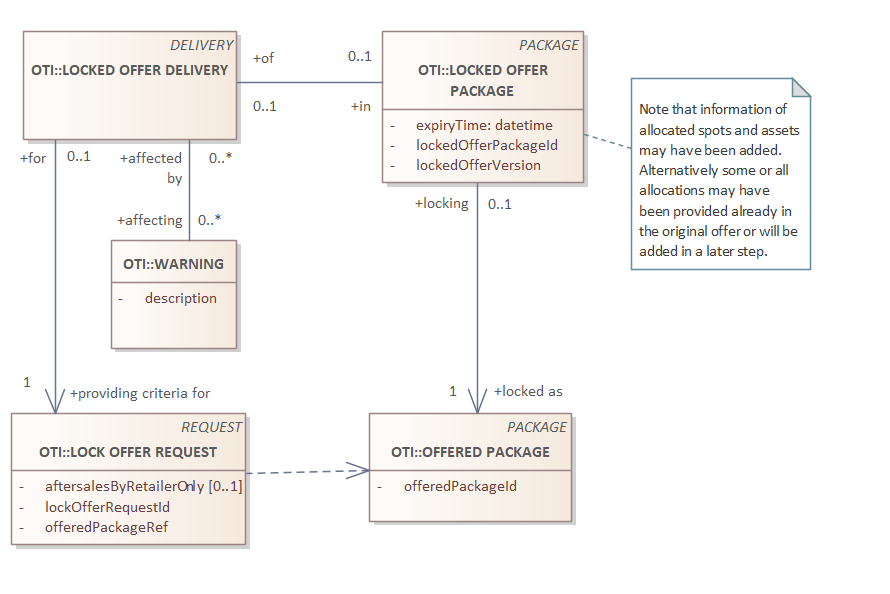

# Lock Offer Delivery

_Required items_
| object | description |
| --- | --- |
| LOCK OFFER DELIVERY | The container for the response |



## LOCK OFFER DELIVERY DETAILS

| field | type | optional/conditions | description |
| --- | --- | --- | --- |
| requestId | string | condition: a-sync | the ID supplied in the request, to match request-response (in case of a-sync call) |
| packageId | string | required | The reference to the locked offer package |
| version | string | required | the (inital) version of the locked offer package |
| expiryTime | date-time | required | expiry time of the lock, ISO 8601 |
| warnings | list of warnings | optional | a list of warnings, in the requested contentLanguage. If this language is not supported, respond in the local accepted language |

Remark: the version number can be a hash (of the offer structure), to validate that the offer hasn't been changed.  
**You CANNOT rely on the fact that the version number increases, in steps of 1.**

## Examples

Remark: the usage of the JSON below is only indicative, to clarify our intensions. It is not how the final result will look like.

### Simple
```json
{
    "packageId": "offer-1",
    "version": "305e50bfa0767185c3f0987277b60f53",
    "expiryTime": "2026-07-01T10:03:00+01"
}
```
