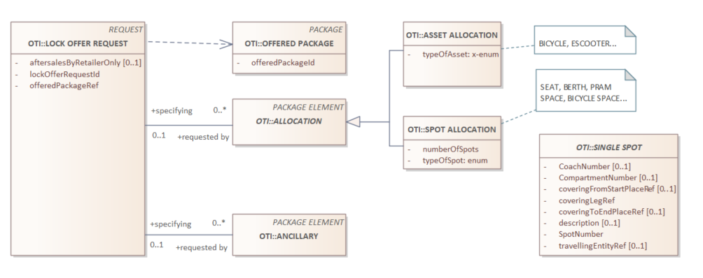

# Lock Offer Request

_Precondition_: There are offers   
_Postcondition_: A single offer is selected, and 'claimed'/'reserved'/'blocked'. In general, it means that the resources required to execute the offer are claimed, and cannot be given to/reserve by another entity. 

_Required items_
| object | description |
| --- | --- |
| LOCK OFFER REQUEST | The main container for the request |
| LOCK OFFER DELIVERY | The container for the response |



## LOCK OFFER REQUEST DETAILS

| field | type | optional/conditions | description |
| --- | --- | --- | --- |
| lockOfferRequestId | string | condition: a-sync | a unique ID, the response to this request MUST have the same ID (in case of a-sync call) |
| offeredPackageRef | string | required | the reference of the offer to lock |
| allocations | list of allocationRef | condition: required allocations |  a list of allocatable seats/assets, subset of the 'required allocations' in the offer |
| ancillaries | list of ancillaryRef | condition: required ancillaries | a list of ancillaries, subset of the 'required ancillaries' in the offer | 
| aftersalesByRetailerOnly | boolean | optional | filter field; is it allowed that the customer can change the offer after purchase directly communicating with the distributor. Default 'false' |
| contentLanguage | string | optional | The language/localization of user-facing content, One IETF BCP 47 (RFC 5646) language tag. If missing, the local accepted language |

Implicit: the offers don't have a 'version' field yet, everything has no version. When locking the offer, the initial version will be assigned.

## Examples

Remark: the usage of the JSON below is only indicative, to clarify our intensions. It is not how the final result will look like.

### Simple
```json
{
    "offerPackageRef": "offer-1",
}
```

### A-sync 
```json
{
    "lockOfferRequestId": "LORI-3249",  # This ID must be repeated in the a-sync delivery
    "offerPackageRef": "offer-2",
}
```

### With a selection of allocations
```json
{
    "offerPackageRef": "offer-2",
    "allocations": { "NORMAL SEAT": 1, "BERTH": 1 }
}
```
Later on, in the 'amend' phase (after the locking), the NORMAL SEAT and BERTH can be replaced by a reference to a specific seat and berth (SINGLE SPOT).

_Exits from locked status_: 
* the offer, or offer elements can be released: the customer announces that it does not want to use this offer (element). The claim(s) can be removed.
* the offer is purchased and can be executed 
* the expiry time of the offer has passed, the claims on the resources are removed.
