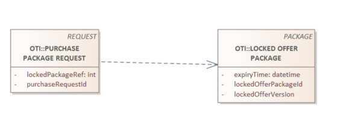
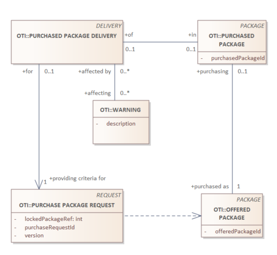

# Purchase package Request - delivery

The purchase can be preceded by a validation of the package, to check if it is valid without executing a (expensive) call to purchase the package.

_Required items_

| object | description |
| --- | --- |
| PURCHASE PACKAGE REQUEST | The purchase request |
| PURCHASE PACKAGE DELIVERY | The accompaning response |

## PURCHASE REQUEST DETAILS

| field | type | optional/conditions | description |
| --- | --- | --- | --- |
| requestId | string | condition: a-sync | a unique ID, the response to this request MUST have the same ID (in case of a-sync call) |
| packageId | string | required | the reference of the package to purchase |
| version | string | required | the version of the locked offer package to purchase |
| personalInformation | List of personal data | conditional | when personal information is required to purchase |
| contentLanguage | string | optional | The language/localization of user-facing content, One IETF BCP 47 (RFC 5646) language tag. If missing, the local accepted language |



```json
{    "packageId": "offer-1",
     "version": "305e50bfa0767185c3f0987277b60f53"
}
```

## PURCHASE DELIVERY DETAILS



### Purchase Delivery

| field | type | optional/conditions | description |
| --- | --- | --- | --- |
| requestId | string | condition: a-sync | a unique ID, the response to this request MUST have the same ID (in case of a-sync call) |
| package | Package | required, but nullable | when the purchases succeeds, there must be a package object |
| expiryTime | date-time | required | expiry time of rollback window, ISO 8601 |
| problems | list of string | required | a list of string, describing blocking issues, in the requested language (or local if not the requested language is not supported) |
| warnings | list of string | required | a list of string, describing non-blocking issues, in the requested language (or local if not the requested language is not supported) |

**Note**: take a look at the PR for the Search-offer Delivery. It contains the `PACKAGE` concept.

#### Effective Purchased Package 
```yaml
type: object
required:
  - packageId
  - summary
  - name
  - matching
  - status
properties:
  packageId:
    type: string
    description: Unique identifier for the package
  version:
    type: string
    description: > 
      The version of the package, which can be used for version control and tracking changes over time.
      Avoid using an increasing integer as the version number, as it may not accurately reflect the content changes. 
      Instead, consider using a hash of the package content or a combination of an internal ID and version number 
      to ensure uniqueness and integrity.
  summary:
    type: string
    description: A brief summary of the package, providing an overview of its contents or purpose.
  name:
    type: string
    description: The name of the package, which can be used for display purposes in user interfaces.
  status:
    type: string
    description: The current status of the package.
    # enum: 
    # - offered
    # - locked
    # - expired
    # - released
    # - purchased
    # - rollback
    # - cancelled
    # - fulfilled
    # - refunded
    # - exchanged
    # - in_progress
    # - completed
    const: purchased # from Purchased Package
  elements:
    type: array
    description: A list of elements that are part of the package
    items:
      oneOf:
        - $ref: .\TravelRight.yaml
        - $ref: .\Ancillary.yaml
        - $ref: .\Allocation.yaml
        - $ref: .\AfterSalesFee.yaml
      discriminator:
        propertyName: packageElementType
        mapping:
          travelRight: .\TravelRight.yaml
          ancillary: .\Ancillary.yaml
          allocation: .\Allocation.yaml
          afterSalesFee: .\AfterSalesFee.yaml
  minimumPrice:
    $ref: .\Cost.yaml
  matching:
    type: string
    description: Indicates the matching status of the package.
    enum: [match, partial-match]
  summaryDetails:
    type: array
    description: A list of detailed summaries related to the package, providing additional context or information.
    items:
      $ref: .\SummaryDetail.yaml
  trip:
    $ref: .\Trip.yaml
  guarantees:
    type: array
    description: A list of guarantees
    items:
      $ref: .\Guarantee.yaml
  travelDocuments:
    type: array
    description: a list of travel documents
    items:
      $ref: .\TravelDocument.yaml
  links:
    type: array
    description: A list of links related to the package, which can provide additional information or actions.
    items:
      $ref: .\Link.yaml
example:
  {
    "packageId": "PK-123",
    "summary": "This is a sample package.",
    "name": "Sample Package",
    "status": "purchased",
    "minimumPrice": { "amount": 100.00, "currency": "USD" },
    "summaryDetails": [
      { 
        "detailType": "geospatial",
        "description": "A route from San Francisco to Los Angeles.",
        "content": { "type": "Feature", "geometry": { "type": "LineString", "coordinates": [[-122.4194, 37.7749], [-118.2437, 34.0522]] } }
      },
      { 
        "detailType": "condition",
        "content": "No pets allowed"
      }
    ],
    "elements": [
      {
        "elementType": "travelRight",
        "packageElementId": "PE-123",
        "numberOfAvailableItems": "5",
        "covering": [ { "startLeg": "L-789", "endLeg": "L-789" } ],
        "price": { "amount": 23.20, "currency": "EUR" },
        "travellingEntities": [ "TE-123", "TE-456" ]
      }, 
      {
        "elementType": "allocation",
        "packageElementId": "PE-124",
        "allocationType": "spot",
        "typeOfSpot": "seat",
        "numberOfAllocatedUnits": 1,
        "reference": "102/36B",
        "appliesTo": [ "PE-123" ]
      }
    ],
    "links": [
      {
        "rel": "lock",
        "href": "https://api.example.com/packages/PK-123/lock",
        "method": "POST",
        "type": "application/json"
      }
    ]
  }
```