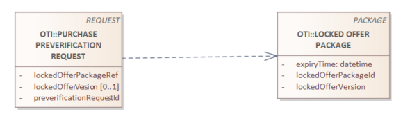
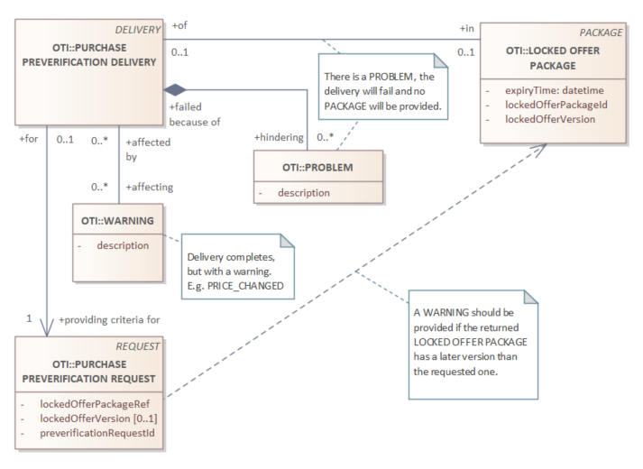

# Validate Request - response

The purchase can be preceded by a validation of the package, to check if it is valid without executing a (expensive) call to purchase the package.

_Required items_

| object | description |
| --- | --- |
| VALIDATE PACKAGE REQUEST | The request to validate the package before purchase, optional |
| VALIDATE PACKAGE DELIVERY | The accompaning response |

## VALIDATE PACKAGE REQUEST DETAILS

| field | type | optional/conditions | description |
| --- | --- | --- | --- |
| requestId | string | condition: a-sync | a unique ID, the response to this request MUST have the same ID (in case of a-sync call) |
| packageId | string | required | the reference of the package to validate |
| version | string | required | the version of the locked offer package to validate |
| personalInformation | List of personal data | conditional | when personal information is required to validate |
| contentLanguage | string | optional | The language/localization of user-facing content, One IETF BCP 47 (RFC 5646) language tag. If missing, the local accepted language |

### Personal Information Type
```yaml
type: string
x-extensible-enum: 
  - fullName
  - firstName
  - lastName
  - dateOfBirth # always in the format YYYY-MM-DD, ISO 8601
  - gender # M for male, F for female, X for non-binary, U for unknown
  - nationality # ISO 3166-1 alpha-2 country code
  - email
  - address # street, city, postal code, country
  - phoneNumber
  - mobileNumber
  - passportNumber
  - passportExpiryDate # always in the format YYYY-MM-DD, ISO 8601
  - passportIssuingCountry  # ISO 3166-1 alpha-2 country code
  - idCardNumber
  - idCardAdditionalNumber
  - idCardExpiryDate # always in the format YYYY-MM-DD, ISO 8601
  - idIssuingOrganisation
  - drivingLicenseNumber
  - drivingLicenseExpiryDate # always in the format YYYY-MM-DD, ISO 8601
  - drivingLicenseIssuingCountry  # ISO 3166-1 alpha-2 country code
description: the type of personal information
```




## Examples

Remark: the usage of the JSON below is only indicative, to clarify our intensions. It is not how the final result will look like.

```json
{    "packageId": "offer-1",
     "version": "305e50bfa0767185c3f0987277b60f53",
     "contentLanguage": "uk-EN"
}
```

A more advanced one, containing personal information:

```json
{    "packageId": "offer-1",
     "version": "305e50bfa0767185c3f0987277b60f53",
     "contentLanguage": "uk-EN",
     "personalInformation": [ { "travellingEntityId": "TR-3492",
                                "fullName": "E. van Dam" 
                              } ]
}
```

## VALIDATE PACKAGE DELIVERY DETAILS

| field | type | optional/conditions | description |
| --- | --- | --- | --- |
| requestId | string | condition: a-sync | a unique ID, the response to this request MUST have the same ID (in case of a-sync call) |
| packageId | string | required | the reference of the validated package |
| version | string | required | the version of the validated locked offer package |
| expiryTime | date-time | required | expiry time of the locked offer, ISO 8601 |
| problems | list of string | required | a list of string, describing blocking issues, in the requested language (or local if not the requested language is not supported) |
| warnings | list of string | required | a list of string, describing non-blocking issues, in the requested language (or local if not the requested language is not supported) |



```json
{    "packageId": "offer-1",
     "version": "305e50bfa0767185c3f0987277b60f53",
     "expiryTime": "2027-07-01T10:55:00Z", 
     "problems": [],
     "warnings": []
}
```