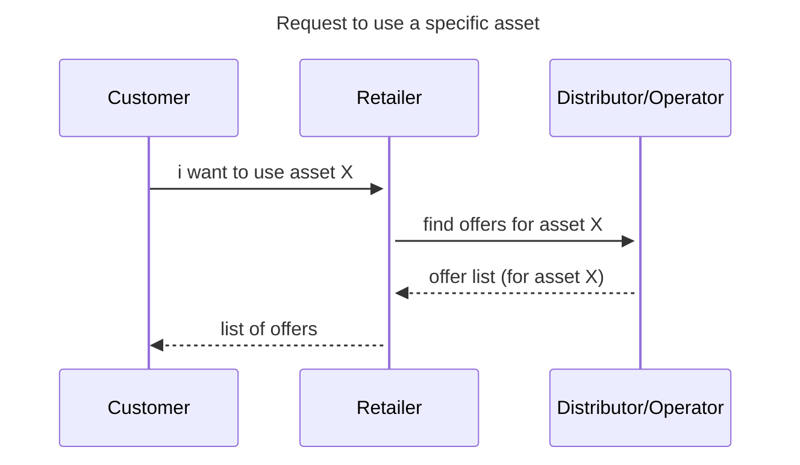
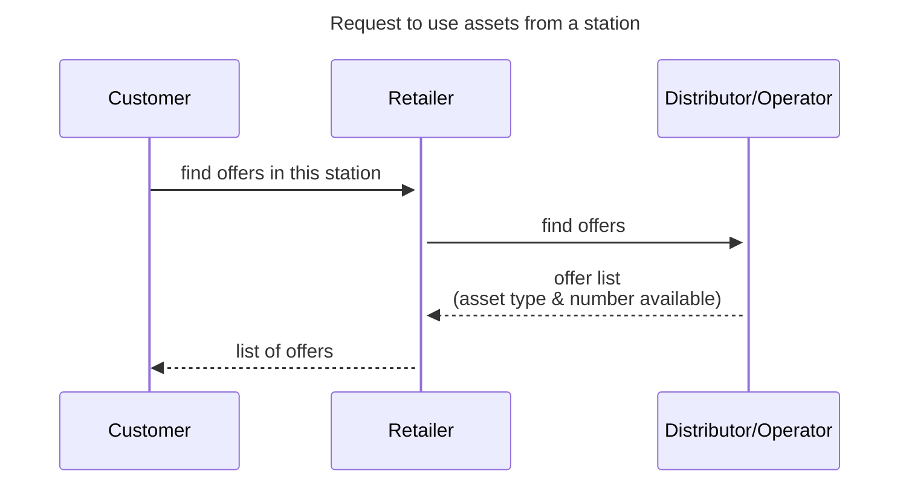
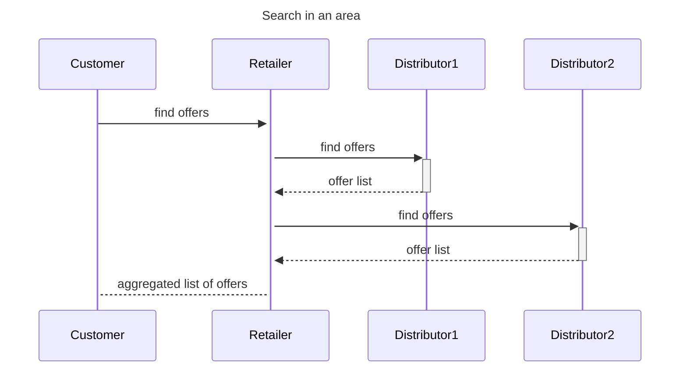

## Use Case Overview (draft)

- **Business Use Case ID & Name:** BUC-K — Search and select a fare for an on-street or shared asset (bike, scooter, parking spot, EV charging point, …)
- **Goal (Objective):** Enable the Customer to find available on-street or shared assets in a given location, retrieve the applicable offers for the selected asset type and desired usage context. The result must be usable to book.

- **Scope:**
  - Retrieve available offers per asset (type), including pricing model (time-based, distance-based, flat-rate, combined), applicable conditions, and constraints
  - Present comparable offers to the Customer
  - Output: a list of offered, usable assets

## Terminology

**Asset**: a physical resource made available for individual short-term use, located at or near a street-level position. Examples: shared bike, shared e-scooter, shared e-moped, on-street parking bay, off-street parking space, EV charging socket, cargo bike. In Transmodel terms: VEHICLE (for moving assets), or PARKING BAY (for static assets).

**Asset fare offer**: a priced, conditioned offer for using a specific asset or asset type for a defined period, start/end location, or distance. Corresponds to a SALES OFFER PACKAGE (and resulting CUSTOMER PURCHASE PACKAGE) whose associated FARE PRODUCT is asset-based (PARKING TARIFF, VEHICLE RENTAL TARIFF, or equivalent).

**Asset availability**: the real-time or near-real-time state of an asset indicating whether it can be used by the Customer now or at a planned time. Corresponds to AVAILABILITY CONDITION applied to a SPOT ALLOCATION or PARKING BAY.

**Usage session**: the period during which the Customer uses a specific asset, from start to end. Described in the companion BUC (BUC-L— Asset Session Management).

**Pricing model**: the commercial formula used to calculate the fare for an asset usage session. Common models: time-based (per minute, per hour, per day), distance-based (per km), flat-rate (fixed fee for a defined slot), combined (unlock fee + per-minute rate), tiered (first N minutes free, then per-minute). Corresponds to PARKING CHARGE BAND, DISTANCE MATRIX ELEMENT, or a TIME INTERVAL applied to a FARE PRODUCT.

## Actors & Context

- **Primary Actors:**
  - **Customer (TRANSPORT CUSTOMER ROLE and PURCHASER ROLE):** the person who wants to use a shared asset. The Customer may act for one or more users (e.g. a group renting several bikes). It can provide location, asset type preference, desired duration, and other needed information.

- **Supporting Actors / Stakeholders:**
  - **Retailer (FARE PRODUCT RETAILER ROLE (API consumer)):** supports the Customer by querying one or more Distributors for offers, consolidating and presenting the results.

  - **Distributor (FARE PRODUCT DISTRIBUTOR ROLE (API provider)):** operates or aggregates one or more asset fleets or parking facilities; provides real-time asset availability, applicable offers with pricing models, usage conditions, and constraints.

- **Assumptions (context at start):**
  - Commercial agreements between the Retailer and the relevant Distributor(s) are in place and the asset is accessible.
  - The Customer's location and asset identification known (GPS, manual entry + QR scan on asset).
  - The Customer can provide required information (age, vehicle type, driving licence, etc).

## Preconditions & Postconditions

- **Preconditions (must be true before start):**
  - The Customer wants to use a specific (type of) asset at a certain location.

- **Postconditions — Success guarantees:**
  - For each offer option, the Customer can see:
    - the asset type or the specific asset identifier
    - the pricing model and calculated indicative or final price (PRICE), including the unlock fee where applicable, per-unit rate (per minute, per km), and any applicable caps or tiered thresholds (PARKING CHARGE BAND / FARE PRODUCT)
    - the applicable usage conditions: maximum session duration, geographic constraints, permitted parking/drop-off zones (VALIDITY CONDITION(s), MOBILITY SERVICE CONSTRAINT ZONE(s))
    - requirements (subscription, reduction right, vehicle type, age) (ENTITLEMENT(s), USER PROFILE)
    - after-sales conditions: whether the session can be cancelled before start and under what conditions (USAGE PARAMETER(s): CANCELLING)
    - real-time or near-real-time asset availability at the requested location (AVAILABILITY CONDITION)

- **Postconditions — Minimal guarantees:**
  - If no asset is available or no fare offer matches the Customer's context, the Customer receives a result without offers.

## Scenarios

### Main scenario

1. The Customer expresses the intent to use an on-street or shared asset.  
 The Customer provides the following selection criteria to the Retailer:  
 - location or area (GPS position, address, or zone),
 - departure time,
 - and asset identification (QR, name, ...) OR asset type (bike, e-scooter, e-moped, parking bay, EV charging point, …),
 - (optional) desired usage duration,
 - and any eligibility information that might impact the result (employer code, driver's license). This last category should be known by the Retailer already, and possibly validated up forehand.

- **Locate available assets**

2. The Retailer determines which Distributor(s) to query based on the requested location, asset (type), and applicable commercial agreements. The Retailer requests available offers (assets or asset types & number available) from the relevant Distributor(s), providing the Customer's location, asset type, desired duration, and context.

3. Each distributor with a station-based solution should return a list of offers per asset type, their common attributes, the pricing model (per-minute, per-km, flat-rate, combined unlock fee + per-minute, tiered, daily cap) (PARKING CHARGE BAND / TIME INTERVAL / DISTANCE MATRIX ELEMENT), how many of this type are available, and an estimated price (band)

4. Each distributor with a non-station-based solution should reply with a list of offers per asset, including it's identification, status (AVAILABILITY CONDITION), the location, the fare structure, any relevant asset-specific attributes relevant (e.g. battery level for electric assets, accessibility features), the pricing model (per-minute, per-km, flat-rate, combined unlock fee + per-minute, tiered, daily cap) (PARKING CHARGE BAND / TIME INTERVAL / DISTANCE MATRIX ELEMENT), and an estimated price (band)

**Extensions**

5. For each offer the Distributor could include:
  - the applicable usage conditions: maximum session duration, service area, permitted parking/drop-off zones, return constraints (VALIDITY CONDITION(s), MOBILITY SERVICE CONSTRAINT ZONE(s))
  - any active subscription or reduction benefit (ENTITLEMENT(s), USER PROFILE)
  - all necessary required booking information categories (e.g. passport number, driver license, name, ...), in order to supply it during the booking
  - cancellation conditions applicable before session start
  
**Present comparable offers**

6. The Retailer consolidates the results from the relevant Distributor(s) into a consistent list of comparable offers and presents them to the Customer. The Retailer may filter, sort, or group options by: distance to asset, price (indicative total for stated duration), pricing model, asset class, or availability. The Customer can compare options side by side.

### Alternatives scenarios
Alternative scenarios **fully compatible** with the main scenario; using shortcuts or very detailed specific points of the main scenario.

##### Walk-up scan (QR code or NFC on the asset)
1. The Customer is standing next to an available asset and scans the QR code or taps the NFC tag on it.
2. The Retailer retrieves the asset identifier and queries the Distributor for the applicable offers for that specific asset, using the Customer's account context where available.
3. The Distributor returns the offer(s) for that specific asset. In most cases, it will only return one offer

##### Pre-planned future use (advance reservation)
1. The Customer is planning a future trip and wants to know the fare for an asset to be used at a specific time and location (e.g. a bike at a hub for tomorrow morning).
2. The Retailer queries the Distributor for asset availability and offers for the requested future time slot. The Distributor returns applicable offers and any pre-booking conditions (availability hold, reservation fee, cancellation conditions).

##### Multiple assets in one session (group use)
1. The Customer wants to use several assets of the same type simultaneously (e.g. a group of four renting four bikes at the same station).
2. The Retailer queries the Distributor for the requested type at the location and the applicable offers for multiple concurrent sessions.
3. The Distributor returns availability and offers, which may differ for group use (group rate, bundle discount). The Customer selects the offer that superflous the needed quantity.

### Diagram
UML activity diagram to point out the flows between Retailer and Distributor

