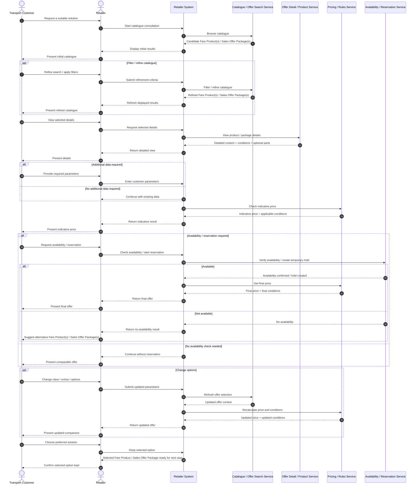

## Part 1 : Use Case Overview

- **Business Use Case ID & Name:** BUC1 — Choice of a solution by FARE PRODUCT catalogue consultation
- **Goal (Objective):** Enable the Transport Customer to select the most suitable fare solution by consulting the Fare Product catalogue and providing the information required to determine the best offer (product, package, price and guarantees).
- **Scope:** Offer discovery / catalogue consultation (FARE PRODUCT catalogue)
---

## Part 2 : Actors & Context

- **Primary Actor:** TRANSPORT CUSTOMER (represented by the retailer (FARE PRODUCT RETAILER role))

- **Supporting Actors / Stakeholders:**
  - **Retailer (FARE PRODUCT RETAILER role(API consumer)):** supports the customer and initiates catalogue consultation
  - **Operator (FARE PRODUCT DISTRIBUTOR role):** provides the FARE PRODUCT catalogue, prices, availability and guarantees

- **Assumptions (context at start):**
  - The retailer is authorised to consult the operator’s FARE PRODUCT catalogue.
  - The catalogue and related pricing/guarantee information are available (online service or accessible dataset).
  - The customer can provide the additional information required to compute/confirm the best offer.

- **Diagram:** :

---

## Part 3 : Preconditions & Postconditions

- **Preconditions (must be true before start):**
  - Access to the operator’s FARE PRODUCT catalogue is available to the reseller.
  - The relevant catalogue (for the operator/network/area) is identified.
  - Basic travel intent is known (at minimum: the customer wants to travel; optionally: zone/route/date/passenger profile).

- **Postconditions — Success guarantees:**
  - One or more candidate offers are identified, including:
    - selected **FARE PRODUCT(s)** and **SALES OFFER PACKAGE(s)** (if applicable)
    - the associated **Price**
    - applicable **Travel Guarantees / conditions**
    - **availability** information (where applicable)
  - The selected option (or shortlist) is available for the next step (e.g., purchase/booking).

- **Postconditions — Minimal guarantees:**
  - If no suitable solution is found, the customer receives a clear “no matching offer” outcome (with a reason where possible).
  - The consultation outcome can be logged/audited (if required by the system).

---

## Part 4 : Main Success Scenario (Happy Path)

### 4.1 User actions:** « list » :

1. The Retailer starts the catalogue consultation on behalf of the Transport Customer, and the Retailer System performs **Browse catalogue** to retrieve an initial set of candidate Fare Product(s) and Sales Offer Package(s).
2. The Transport Customer reviews the initial results and may perform **Filter / refine catalogue** to narrow the displayed Fare Product(s) and Sales Offer Package(s) according to the consultation context.
3. The Transport Customer selects one candidate and performs **View product / package details** so that the Retailer can present the detailed content, conditions, guarantees, and optional parts of the selected Fare Product or Sales Offer Package.
4. If the selected Fare Product or Sales Offer Package is not yet fully defined, the Transport Customer performs **Enter customer parameters** by providing the required information, such as traveller profile, eligibility, class, date, zone, quantity, or extras.
5. Once the required information is available, the Retailer System performs **Check indicative price** and returns the indicative price together with the applicable commercial and travel conditions for the selected Fare Product or Sales Offer Package.
6. If needed, the Transport Customer performs **Check availability / start reservation**, and the Retailer System verifies availability or starts a temporary hold for the selected Fare Product or Sales Offer Package.
7. If availability is confirmed, the Retailer System performs **Get final price** and returns the final price and final conditions for the selected Fare Product or Sales Offer Package.
8. Before making a final choice, the Transport Customer may perform **Change options** to modify class, extras, or other defining elements, and the Retailer System refreshes the offer and recalculates the corresponding conditions and price.
9. The Transport Customer chooses the preferred solution, and the Retailer System performs **Keep selected option** so that the chosen Fare Product or Sales Offer Package is ready for the next booking or purchase step.

### 4.2 Sequence diagram:**

## Part 5 Alternative Flows (Variants)

- **A1 — Customer refines the search using filters** (Condition: The initial catalogue view does not show a suitable product.)
  - Change at Step 2: The customer navigates through catalogue pages and/or applies pre-defined filters (operator, locally usable products, popularity, marketing priorities).
  - Outcome: The system refreshes the displayed SALES OFFER PACKAGEs until a suitable one is found.

- **A2 — “Simple” product (no additional data required)** (Condition: The selected SALES OFFER PACKAGE is simple, e.g., an immediate single ticket.) 
  - Change at Step 4: No additional information is needed; the system can provide an indicative price immediately at selection time.
  - Outcome: The customer can compare/choose with an immediate indicative price.

- **A3 — Product requires additional customer inputs** (Condition: The selected SALES OFFER PACKAGE is not fully defined.)
  - Change at Step 4: The system prompts for missing information (e.g., time of travel, seating class, railcard).
  - Outcome: Once provided, the system completes the product definition and updates price/conditions accordingly.

- **A4 — Reservation optional vs mandatory** (Condition: The product definition states reservation is not needed / optional / mandatory.)
  - Change at Step 6: If optional, the customer may proceed without reservation (indicative price) or start reservation for availability/final price; if mandatory, reservation is required to obtain availability and final price.
  - Outcome: Either an indicative price is provided early, or a reservation flow is initiated to confirm availability and final price.

---

## Part 6 — Exception Flows (Errors)

- **E1 — No availability during reservation** (Condition: Reservation is started and availability is not confirmed: quota full / no seats.)
  - System behaviour: The system indicates “no availability”.
  - Result: The customer changes an option (e.g., comfort class) or selects another FARE PRODUCT / SALES OFFER PACKAGE. 

- **E2 — Offer remains undefined due to missing data** (Condition: Required parameters are not provided, e.g., class, railcard.) 
  - System behaviour: The system cannot compute a final offer and prompts the customer to provide the missing data or choose a different product.
  - Result: Failure to compute final offer until missing parameters are provided (or alternative product chosen).

- to add ???
Price expired or no longer valid after reservation delay
Unsupported filter combination in a given standard implementation
---

## Part 7 — Business Rules

- **BR1:** Catalogue presentation rules: products may be ordered by network, zone, product type, popularity, local usability, marketing rules, or operator/platform priorities.
- **BR2:** Usage parameters: travel conditions can include interchange allowance, break of journey, validity duration, etc. 
- **BR3:** Commercial conditions: rules may apply for exchanging, refunding, cancelling, reserving, etc.
- **BR4:** Optional paid parameters: some parameters may be optional but available at an additional price (e.g., different luggage allowances).
- **BR5:** Reservation rule: reservation can be not needed / optional / mandatory depending on the SALES OFFER PACKAGE definition.
- **BR6:** Pricing rule:
  - Without reservation or without additional data, an **indicative** price may be provided early.
  - With reservation, the customer obtains the price for a completely defined Travel Package (final price after availability).

---

## Part 8 — Data (Inputs & Outputs)

- **Inputs (source → data):**
  - Customer/channel → FARE PRODUCT / SALES OFFER PACKAGE selection (catalogue item).
  - Customer/channel → Additional defining data when needed: time of travel, seating class, railcard/reduction cards, and other usage parameters.
  - Customer/channel → Reservation/availability parameters (when applicable): quota vs seat selection on a map for scheduled journeys.
  - Customer/channel → Optional extras selection (e.g., luggage allowance option).

- **Outputs (recipient ← data):**
  - Customer/channel ← List of SALES OFFER PACKAGEs and detailed information (network/lines/stops/connections).
  - Customer/channel ← Travel conditions and commercial conditions (exchange/refund/cancellation/reservation rules).
  - Customer/channel ← Availability result (if reservation process is started).
  - Customer/channel ← Price: indicative (early) and/or final price (after full definition and availability when relevant).

- **Stored / persisted information (if any):** Consultation outcome may be logged/audited (if required by the system).

---

## Part 9 — Interfaces / API / user-actions

### 9.1 Business user-actions and interface mapping

| User action                           | Business intent                                              | Expected result                                                      |
| ------------------------------------- | ------------------------------------------------------------ | -------------------------------------------------------------------- |
| Browse catalogue                      | Open the fare/product catalogue                              | Visible list of products / packages relevant to the customer context |
| Filter / refine catalogue             | Narrow the visible list                                      | Smaller set of matching products / packages                          |
| View product or package details       | Understand conditions and composition                        | Detailed offer / product content, conditions, optional parts         |
| Enter customer parameters             | Complete missing data needed for offer determination         | Search / pricing context becomes complete                            |
| Check indicative price                | Get a first price estimate                                   | Indicative price and basic conditions                                |
| Check availability                    | Verify sellability / reservability                           | Availability / pre-booking / seat / quota result                     |
| Get final price                       | Obtain the final commercial result after full definition     | Final price with conditions and guarantees                           |
| Change options                        | Modify class, extras, passenger profile, etc.                | Updated offer / price / conditions                                   |
| Keep shortlisted option for next step | Preserve selected solution for booking/purchase continuation | Selected offer/package ready for downstream process                  |

### 9.2 Interfaces by user-action and standard

#### A. User action: “Browse catalogue”

Business meaning:
The reseller opens a catalogue or product/offer search entry point to display a first set of eligible fare products, packages or services.

| Standard / source | API / message / user-action                                           | Type                      | Role in this BUC                                                                                         | Parameters / returned data                                                                                                                                                                               |
| ----------------- | --------------------------------------------------------------------- | ------------------------- | -------------------------------------------------------------------------------------------------------- | -------------------------------------------------------------------------------------------------------------------------------------------------------------------------------------------------------- |
| Ticketing         | `get sale labels`                                                     | Reference data            | Retrieve labels, names and descriptions of FARE PRODUCTs and Sales Offer Packages for catalogue browsing | Returns names, descriptions, labels, comments of FARE PRODUCTs, Sales Offer Packages, payment means, social status and other purchase reference data                                                     |
| Ticketing         | `search-non-trip-offers-media`                                        | Catalogue / offer query   | Retrieve suitable Sales Offer Packages for non-trip-based consultation                                   | Filters may include product type, network, stop point, fare zone, valid media; returns eligible Sales Offer Packages limited to customer media                                                           |
| OSDM              | `POST /offers` (non-trip-based offer search)                          | Offer search              | Main entry point to browse non-trip-based offers                                                         | Search parameters include begin of validity, region, PLACE, FARE CLASS, flexibility, PRODUCT TAGs, passenger types; returns Sales Offer Packages                                                         |
| OSDM              | `POST /product-search`                                                | Product search            | Optional preliminary product search before full offer retrieval                                          | Structured product-search criteria; returns candidate products to support catalogue browsing                                                                                                             |
| OSDM              | `GET /products`, `GET /products/{productId}`, `POST /products-search` | Product catalogue         | Retrieve catalogue content independently from offer search                                               | Returns FARE PRODUCT definitions, names, descriptions, conditions; search supports product tags and filters                                                                                              |
| OSDM              | `GET /product-tags`                                                   | Catalogue taxonomy        | Support browsing by product family / navigation taxonomy                                                 | Returns PRODUCT TAGs and PRODUCT TAG GROUPs used to categorise products                                                                                                                                  |
| OMSA              | `POST /processes/search-offers/execute`                               | Offer search              | Search Sales Offer Packages from travel specification                                                    | Inputs include origin, destination, via, intended departure/arrival time, traveller/user profile, travelling assets; returns priced offer collection with legs, FARE PRODUCTs, ancillaries, expiry time  |
| TOMP-API          | `POST /processes/search-offers/execution`                             | Offer search              | Search operator offers matching a travel specification                                                   | Travel specification may include traveller profiles and PRM needs; returns offers / packages matching request context                                                                                    |
| TOMP-API          | `GET /collections/fares/items`                                        | Fare lookup               | Lightweight fare/product consultation without exposing full fare tables                                  | Query based on user profile, entitlements, card types, products, start/end locations; returns a single fare overview                                                                                     |
| FerryGateway      | `GetRoutes` / `GetRoutesResponse`                                     | Reference data            | Browse available ferry routes as first-level catalogue entry point                                       | Returns routes as port pairs + operator identifiers                                                                                                                                                      |
| FerryGateway      | `GetTimeTablesRequest` / `GetTimeTablesResponse`                      | Timetable browsing        | Browse sailings before pricing and reservation                                                           | Parameters include operator, port pair, date range; returns sailing timetable with vessel and timing data                                                                                                |
| FerryGateway      | `GetSailingsRequest` / `GetSailingsResponse`                          | Search / availability     | Discover bookable sailing options                                                                        | Inputs include departure date, passengers, vehicles, pets, minicruise / alternatives flags; returns sailing combinations and availability flags                                                          |
| BoB               | `POST /product`                                                       | Product search            | Main structured product search for catalogue consultation                                                | `productFilter` may include area/group/route filters, traveller categories, generic categories, discount codes, temporal constraints; returns `productSetAlternatives`                                   |
| BoB               | `GET /product`                                                        | Simplified product search | Lightweight browsing/search entry point                                                                  | Query params may include product/fare/traveller category IDs and stop area IDs; returns matching products                                                                                                |
| BoB               | `GET /product/{productId}`                                            | Product detail lookup     | Retrieve one selected product from catalogue                                                             | Returns detailed product information for a given `productId`                                                                                                                                             |

#### B. User action: “Filter / refine catalogue”

Business meaning:
The customer or reseller narrows the product list using context and eligibility criteria.
| Standard / source | API / message / user-action                                                                                        | Type                      | Role in this BUC                                             | Parameters / returned data                                                                                                                                               |
| ----------------- | ------------------------------------------------------------------------------------------------------------------ | ------------------------- | ------------------------------------------------------------ | ------------------------------------------------------------------------------------------------------------------------------------------------------------------------ |
| Ticketing         | `search-non-trip-offers-media`                                                                                     | Filtered offer query      | Narrow the list of visible Sales Offer Packages              | Parameters may include product type, network, stop point, fare zone, valid media; returns filtered eligible offers                                                       |
| OSDM              | `POST /offers`                                                                                                     | Refined offer search      | Filter product/offer catalogue according to customer context | Inputs include region, PLACE, begin of validity, passenger types, FARE CLASS, flexibility, PRODUCT TAGs; returns filtered offer collection                               |
| OSDM              | `GET /product-tags`                                                                                                | Taxonomy retrieval        | Provide filter values used by UI/search                      | Returns grouped PRODUCT TAGs for structured narrowing of search space                                                                                                    |
| OSDM              | `GET /places`, `GET /zones`, `GET /passenger-categories`, `GET /reduction-cards`                                   | Supporting reference data | Provide allowed filter dimensions                            | Returns PLACE references, ZONE definitions, PASSENGER CATEGORY definitions, REDUCTION CARD types                                                                         |
| OMSA              | `POST /processes/search-offers/execute`                                                                            | Refined offer search      | Apply trip/traveller criteria to limit returned packages     | Parameters include origin, destination, via points, intended time, traveller descriptions, travelling assets; returns filtered offer collection                          |
| TOMP-API          | `POST /processes/search-offers/execution`                                                                          | Refined offer search      | Narrow operator offers by traveller and travel context       | Parameters may include travel specification, traveller profile, PRM needs; returns filtered offers/packages                                                              |
| TOMP-API          | `GET /collections/user-profiles/items`, `GET /collections/entitlements/items`, `GET /collections/card-types/items` | Reference data            | Provide dimensions usable as search filters                  | Returns accepted user profiles, entitlements and card types recognised by operator                                                                                       |
| FerryGateway      | `GetSailingsRequest`                                                                                               | Filtered sailing search   | Narrow sailing catalogue to relevant combinations            | Inputs include passenger/vehicle mix, pet presence, date, `IsOnlyMinicruise`, `ShowAlternativeRoutes`; returns filtered sailings and availability flags                  |
| BoB               | `POST /product`                                                                                                    | Filtered product search   | Narrow product search through structured filters             | `productFilter` supports area/group/route, traveller categories, generic categories, discount codes, date/time and property constraints; returns candidate product sets  |

#### C. User action: “View product / package details”

Business meaning:
The reseller displays the full content of the selected product or offer so the customer can understand what is being bought.
| Standard / source | API / message / user-action                                           | Type                            | Role in this BUC                                                                  | Parameters / returned data                                                                                               |
| ----------------- | --------------------------------------------------------------------- | ------------------------------- | --------------------------------------------------------------------------------- | ------------------------------------------------------------------------------------------------------------------------ |
| Ticketing         | `get sale labels`                                                     | Reference data / detail support | Display names and descriptions of selected FARE PRODUCTs and Sales Offer Packages | Returns names, descriptions, labels and comments associated with catalogue items                                         |
| OSDM              | `GET /products/{productId}`                                           | Product detail                  | Retrieve detailed FARE PRODUCT content                                            | Input: `productId`; returns product definition, description, conditions                                                  |
| OSDM              | Results from `POST /offers`                                           | Offer detail                    | Display full selected offer/package content                                       | Returns Sales Offer Packages with offer parts, pricing logic, optional parts and booking-related content                 |
| OMSA              | Offer collection from `POST /processes/search-offers/execute`         | Offer detail                    | Expose package composition before selection                                       | Returns priced Sales Offer Packages with legs, FARE PRODUCTs, ancillaries and expiry time                                |
| TOMP-API          | `GET /collections/offers/items`                                       | Offer detail                    | Retrieve detailed offer information for consultation                              | Returns offer details and linked package/leg information                                                                 |
| TOMP-API          | `GET /collections/assets/items`, `GET /collections/ancillaries/items` | Related option lookup           | Show related assets and ancillaries available with selected offer                 | Returns physical assets, seat/space or ancillary possibilities depending on offer/leg context                            |
| FerryGateway      | `GetServicesRequest` / `GetServicesResponse`                          | Service detail                  | Show available service content associated with a sailing                          | Inputs include sailing and service mode; returns cabins, meals, on-board services, land services and service attributes  |
| BoB               | `GET /product/{productId}`                                            | Product detail                  | Show detailed information for one selected product                                | Input: `productId`; returns detailed FARE PRODUCT content and metadata                                                   |

#### D. User action: “Enter customer parameters / complete missing data”

Business meaning:
The system cannot fully determine the best solution until additional traveller, eligibility, class, date, zone or option data is entered.
| Standard / source | API / message / user-action                                                                                        | Type                          | Role in this BUC                                                            | Parameters / returned data                                                                                                            |
| ----------------- | ------------------------------------------------------------------------------------------------------------------ | ----------------------------- | --------------------------------------------------------------------------- | ------------------------------------------------------------------------------------------------------------------------------------- |
| Ticketing         | Inputs before `Get fare price`                                                                                     | Pricing input completion      | Complete the data required to compute the right offer/price                 | Customer account plus pricing parameters; downstream result is calculated price for CUSTOMER PURCHASE PACKAGE                         |
| OSDM              | `PATCH /bookings/{bookingId}/passengers/{passengerId}`                                                             | Passenger update              | Supply required passenger data after pre-booking                            | Input: missing attributes from `requestedInformation` such as first/last name, DOB, contact; returns updated passenger/booking state  |
| OMSA              | `POST /processes/add-traveller/execute`                                                                            | Traveller creation on package | Add traveller information to package before final pricing/purchase          | Inputs include traveller identity/profile, entitlements, licences, access-right needs; returns updated `package`                      |
| OMSA              | `POST /processes/update-traveller/execute`                                                                         | Traveller update on package   | Correct or enrich traveller attributes                                      | Inputs include updated personal/commercial profile or entitlement attributes; returns updated `package`                               |
| TOMP-API          | `POST /collections/customers/items`, `PATCH /collections/customers/items/{customerId}`                             | Customer management           | Create/update customer data used by operator for offer determination        | Submitted data may include personal data, cards, licences; returns stored customer resource / updated profile                         |
| TOMP-API          | `POST /processes/update-traveller/execution`                                                                       | Traveller update              | Update traveller data already attached to a package                         | Inputs may include updated traveller details or PRM needs; returns updated package/traveller context                                  |
| TOMP-API          | `GET /collections/license-types/items`, `GET /collections/card-types/items`, `GET /collections/entitlements/items` | Reference data                | Provide accepted input types for licences/cards/entitlements                | Returns allowed licence types, card types and entitlements accepted by operator                                                       |
| FerryGateway      | `GetPassengerAndVehicleTypesRequest` / `GetPassengerAndVehicleTypesResponse`                                       | Reference data                | Retrieve valid passenger and vehicle categories required for search/pricing | Returns passenger age-band categories and vehicle dimension categories                                                                |
| BoB               | `GET /productcat/traveller`, `GET /productcat/generic`                                                             | Reference data                | Provide category values needed to complete product selection inputs         | Returns traveller categories and generic category names/allowed values such as fare class or transport mode                           |

#### E. User action: “Check indicative price”

Business meaning:
When the package is sufficiently defined, the system provides an early price estimate before reservation or final confirmation.
| Standard / source | API / message / user-action                 | Type                       | Role in this BUC                                                    | Parameters / returned data                                                                                                                                |
| ----------------- | ------------------------------------------- | -------------------------- | ------------------------------------------------------------------- | --------------------------------------------------------------------------------------------------------------------------------------------------------- |
| Ticketing         | `Get fare price`                            | Pricing                    | Calculate indicative or final price depending on input completeness | Inputs: customer account and pricing parameters; returns calculated price for CUSTOMER PURCHASE PACKAGE                                                   |
| Ticketing         | `Get payment terms and instalments details` | Commercial pricing details | Complement price with commercial/payment conditions                 | Inputs: customer account and other inputs; returns payment terms, instalment periods, amounts, free periods, ended instalments for a Sales Offer Package  |
| OSDM              | `POST /offers`                              | Priced offer search        | Return priced offers usable as early comparison basis               | Inputs include non-trip or trip-based criteria; returns Sales Offer Packages with prices and conditions                                                   |
| OMSA              | `POST /processes/search-offers/execute`     | Priced offer search        | Return priced Sales Offer Packages before package purchase          | Inputs include TRAVEL SPECIFICATION and traveller data; returns priced offer collection with expiry time                                                  |
| TOMP-API          | `GET /collections/fares/items`              | Fare lookup                | Retrieve one fare anonymously or with limited parameterisation      | Query may include user profile, entitlements, card types, products and start/end locations; returns single fare overview                                  |
| TOMP-API          | `POST /processes/search-offers/execution`   | Priced offer search        | Return priced offers as part of offer search                        | Inputs include travel specification and traveller context; returns priced offers/packages                                                                 |
| FerryGateway      | `GetPriceRequest` / `GetPriceResponse`      | Pricing                    | Return price for selected sailing combination                       | Inputs include selected FerryComponent, passengers, vehicles and services; returns price breakdown, token and token expiry time                           |
| BoB               | `POST /manifest`                            | Manifest + fare breakdown  | Return fare breakdown for selected products before ticket issuance  | Inputs include selected product identifiers, discount codes, overrides; returns signed manifest, fare breakdown, `manifestId`, expiry, distinct flag      |

#### F. User action: “Check availability / start reservation”

Business meaning:
The customer wants to know whether the selected solution is actually available and, where needed, to temporarily hold capacity.
| Standard / source | API / message / user-action                                              | Type                    | Role in this BUC                                             | Parameters / returned data                                                                                                                                          |
| ----------------- | ------------------------------------------------------------------------ | ----------------------- | ------------------------------------------------------------ | ------------------------------------------------------------------------------------------------------------------------------------------------------------------- |
| OSDM              | `POST /bookings`                                                         | Pre-booking / selection | Select offer and start provisional booking                   | Inputs: selected offer IDs and optional reservation/ancillary offer-part IDs; returns booking in `PREBOOKED` state with time limit                                  |
| OSDM              | `GET /availabilities/preferences`                                        | Availability query      | Get available places or reservation preferences              | Context can target an OFFER or BOOKING; returns available places/preferences with properties such as window/aisle/table/quiet zone                                  |
| OSDM              | `GET /availabilities/place-map`, `GET /availabilities/vehicle-place-map` | Seat/space map          | Retrieve graphical seat/space map where relevant             | Returns coach-layout/place-map data for reservation selection                                                                                                       |
| OSDM              | `GET /availabilities/nearby`                                             | Nearby-seat query       | Find seats near a reference place                            | Returns available adjacent or nearby places for group seating                                                                                                       |
| OMSA              | `GET /collections/assets/items`                                          | Asset availability      | Check available physical assets for a leg/package            | Filtered by `packageId`, optionally `legId`, and possibly `bbox`; returns available assets as feature collection                                                    |
| OMSA              | `GET /collections/ancillaries/items`                                     | Ancillary availability  | Check optional ancillaries available for a leg/package       | Filtered by `packageId`, optionally `legId`; returns available ancillary catalogue                                                                                  |
| TOMP-API          | `GET /collections/assets/items`                                          | Asset availability      | Retrieve overview of available assets in future or for a leg | Returns physical assets, possibly scoped to leg/package and including seat-plan related data where relevant                                                         |
| TOMP-API          | `GET /collections/ancillaries/items`                                     | Ancillary availability  | Retrieve available ancillaries that can be added             | Returns ancillary items available for leg/package context                                                                                                           |
| TOMP-API          | `POST /processes/use-asset/execution`                                    | Direct asset selection  | Use/select a specific asset directly                         | Inputs identify asset/station and context; returns package/usage state associated with selected asset                                                               |
| FerryGateway      | `GetSailingsRequest` / `GetSailingsResponse`                             | Availability search     | Retrieve real-time sailing availability                      | Inputs include passengers, vehicles, pets, date and options; returns availability flags (`IsVehicleAvailable`, `IsPetAvailable`, `IsAccommodationAvailable`, etc.)  |
| FerryGateway      | `ReservationRequest` / `ReservationResponse`                             | Temporary reservation   | Hold selected sailing and fare without final commitment      | Inputs specify party and selected sailing/fare; returns reservation with status `Reserved`                                                                          |
| FerryGateway      | `GetServicesRequest` / `GetServicesResponse`                             | Service availability    | Retrieve available purchasable services for a sailing        | Inputs include sailing and `Mode`; returns cabins, meals, on-board and land services                                                                                |
| BoB               | `POST /booking`                                                          | Preliminary booking     | Create preliminary booking for seat-reserved journey         | Input includes signed manifest, optional traveller data, phone number, requestId; returns booking in `pending` status with `confirmBefore` deadline                 |

#### G. User action: “Get final price”

Business meaning:
After all required parameters and availability checks are complete, the system returns the final commercial result.
| Standard / source | API / message / user-action                                | Type                             | Role in this BUC                                                 | Parameters / returned data                                                                                          |
| ----------------- | ---------------------------------------------------------- | -------------------------------- | ---------------------------------------------------------------- | ------------------------------------------------------------------------------------------------------------------- |
| Ticketing         | `Get fare price`                                           | Final pricing                    | Return price once package is fully defined                       | Inputs: customer account and full pricing parameters; returns calculated final price for CUSTOMER PURCHASE PACKAGE  |
| Ticketing         | `Checkout travel basket`                                   | Basket validation / pre-purchase | Lock and validate basket before final purchase                   | Checks basket consistency and locks basket while waiting for reservation/payment results                            |
| OSDM              | `POST /bookings/{bookingId}/fulfillment-check`             | Consistency check                | Validate that booking is confirmable before fulfillment          | Input: `bookingId`; returns check outcome for confirmable state and data completeness                               |
| OMSA              | Package result after selection / traveller completion      | Final priced package state       | Materialise final package state once all elements are known      | Returns updated `package` with chosen offers/travellers/assets/ancillaries and resulting commercial state           |
| TOMP-API          | Package result after search / traveller / asset completion | Final priced package state       | Materialise final package price once package is fully determined | Returns updated package/offer state reflecting selected options and final context                                   |
| FerryGateway      | `GetPriceRequest` / `GetPriceResponse`                     | Final pricing                    | Return locked valid price ready for booking                      | Returns price breakdown, lock token and token expiry time                                                           |
| BoB               | `POST /manifest`                                           | Fare breakdown                   | Return authoritative commercial breakdown for selected products  | Returns signed manifest, fare breakdown, expiry and manifest status info                                            |

#### H. User action: “Change class / add options / update selection”

Business meaning:
The customer changes the initial choice and asks the system to recompute the best solution.
| Standard / source | API / message / user-action                                                                          | Type                           | Role in this BUC                                                   | Parameters / returned data                                                                                                           |
| ----------------- | ---------------------------------------------------------------------------------------------------- | ------------------------------ | ------------------------------------------------------------------ | ------------------------------------------------------------------------------------------------------------------------------------ |
| Ticketing         | `Modify basket element` / repeat search-pricing flow                                                 | Basket update / repricing      | Update quantity, discount/reduction or selected package content    | Returns updated basket element context; repricing occurs downstream as needed                                                        |
| OSDM              | `PATCH /bookings/{bookingId}/booked-offers/{bookedOfferId}/offer-parts`                              | Offer-part update              | Change optional offer parts on a pre-booked offer                  | Input updates the booked-offer offer-parts list; returns updated booking content                                                     |
| OSDM              | `POST .../ancillaries`, `DELETE .../ancillaries`, `POST .../reservations`, `DELETE .../reservations` | Optional-part add/remove       | Add or remove optional ancillary/reservation items                 | Inputs identify booking, booked offer and item; returns updated booking state                                                        |
| OMSA              | `POST /processes/select-offers/execute`                                                              | Offer reselection              | Recompose package from a different set of offers                   | Inputs identify selected offer IDs; returns updated `package` in selected status                                                     |
| OMSA              | `POST /processes/assign-asset/execute`, `POST /processes/assign-ancillary/execute`                   | Asset / ancillary update       | Update assigned asset or ancillary for a leg                       | Inputs reference package, leg and asset/ancillary, with optional replace id; returns updated `package`                               |
| TOMP-API          | `POST /processes/update-travel-specification/execution`                                              | Travel-spec update             | Modify dates/locations before purchase                             | Inputs update departure/arrival times and/or locations; returns updated package/offer context                                        |
| TOMP-API          | `POST /processes/remove-offer/execution`                                                             | Offer removal                  | Remove one offer from a multi-offer package                        | Inputs identify package and offer to remove; returns updated package state                                                           |
| TOMP-API          | `POST /processes/assign-asset/execution`, `POST /processes/assign-ancillary/execution`               | Asset / ancillary reassignment | Change assigned asset or ancillary                                 | Inputs identify package, leg and new asset/ancillary; returns updated package state                                                  |
| FerryGateway      | Re-run `GetPrice`, `GetServices`, `ReservationRequest` with updated selection                        | Repricing / reselection        | Recompute fare and held options after changes                      | Inputs reflect changed passengers, vehicles, services or sailing selection; returns updated services, price or reservation response  |
| BoB               | `POST /manifest`                                                                                     | Manifest regeneration          | Recompute product set and commercial result after selection change | Inputs include updated selected products/properties/discount codes; returns new signed manifest and updated fare breakdown           |

#### I. User action: “Keep selected option for the next step”

Business meaning:
The chosen result is preserved so the purchase/booking process can continue.
| Standard / source | API / message / user-action                           | Type                           | Role in this BUC                                                                | Parameters / returned data                                                                                    |
| ----------------- | ----------------------------------------------------- | ------------------------------ | ------------------------------------------------------------------------------- | ------------------------------------------------------------------------------------------------------------- |
| Ticketing         | `Add to basket`                                       | Basket persistence             | Preserve selected CUSTOMER PURCHASE PACKAGE for downstream checkout/purchase    | Input: selected CUSTOMER PURCHASE PACKAGE; returns created/updated basket                                     |
| OSDM              | `POST /bookings`                                      | Booking persistence            | Persist selected offer(s) into booking context                                  | Inputs: selected offer IDs and optional offer-part IDs; returns booking in `PREBOOKED` state with time limit  |
| OMSA              | `POST /processes/select-offers/execute`               | Package persistence            | Persist selected offers into a package                                          | Inputs: selected offer IDs; returns `package` in selected status                                              |
| TOMP-API          | Package / offer selection state                       | Package persistence            | Keep package ready for later purchase / confirmation / release                  | Returns package state reflecting current selected or pending commercial context                               |
| FerryGateway      | `ReservationRequest`                                  | Reservation persistence        | Hold selected ferry solution for later confirmation                             | Returns reservation in `Reserved` state with booking context preserved                                        |
| BoB               | `POST /manifest` or `POST /booking` depending context | Manifest / booking persistence | Preserve selected products as signed commercial artefact or preliminary booking | Returns signed `manifestId` and fare breakdown, or booking in `pending` status for reserved journeys          |

- **9.3 Operations / Endpoints:** 
Consolidated interface inventory

| Format-origin | API name | User-action | Short description |
|---|---|---|---|
| Ticketing | `get sale labels` | **Browse catalogue** | Retrieves labels, names, and descriptions used to expose Fare Product(s) and Sales Offer Package(s) in catalogue consultation. |
| Ticketing | `search-non-trip-offers-media` | **Browse catalogue** | Searches candidate non-trip offers and returns eligible Sales Offer Package(s) based on consultation context and media constraints. |
| Ticketing | `search-non-trip-offers-media` | **Filter / refine catalogue** | Refines the visible Fare Product(s) and Sales Offer Package(s) according to filters such as network, zone, stop, or supported media. |
| Ticketing | `Get fare price` | **Check indicative price** | Calculates the price of the selected Fare Product or Sales Offer Package once enough input parameters are available. |
| Ticketing | `Get payment terms and instalments details` | **Check indicative price** | Returns payment conditions associated with the selected Fare Product or Sales Offer Package. |
| Ticketing | `Add to basket` / basket update | **Keep selected option** | Preserves the selected Fare Product or Sales Offer Package for the next booking or purchase step. |
| OSDM | `GET /products` | **Browse catalogue** | Retrieves the available Fare Product(s) exposed by the provider catalogue. |
| OSDM | `POST /products-search` | **Browse catalogue** | Searches Fare Product(s) matching an initial customer context. |
| OSDM | `POST /offers` | **Browse catalogue** | Returns candidate offer results, including Sales Offer Package(s), for the specified context. |
| OSDM | `POST /offers` | **Filter / refine catalogue** | Refines candidate Fare Product(s) and Sales Offer Package(s) using dates, places, passenger categories, tags, and other search criteria. |
| OSDM | `GET /product-tags` | **Filter / refine catalogue** | Provides tag values used to narrow the catalogue of Fare Product(s). |
| OSDM | `GET /products/{productId}` | **View product / package details** | Retrieves detailed information and conditions for a selected Fare Product. |
| OSDM | `PATCH /bookings/{bookingId}/passengers/{passengerId}` | **Enter customer parameters** | Completes missing traveller data required to fully determine the selected Fare Product or Sales Offer Package. |
| OSDM | `POST /bookings` | **Check availability / start reservation** | Creates a pre-booking context for the selected Sales Offer Package and starts the reservation flow when applicable. |
| OSDM | `GET /availabilities/preferences` | **Check availability / start reservation** | Returns availability-related preferences and possible assignable places. |
| OSDM | `GET /availabilities/place-map` | **Check availability / start reservation** | Provides the place map needed to inspect seat or place availability. |
| OSDM | `GET /availabilities/nearby` | **Check availability / start reservation** | Searches nearby available places when the preferred selection is not available. |
| OSDM | `POST /bookings/{bookingId}/fulfillment-check` | **Get final price** | Confirms that the selected Fare Product or Sales Offer Package is valid and ready for downstream fulfillment with final commercial consistency. |
| OSDM | `PATCH /bookings/{bookingId}/booked-offers/{bookedOfferId}/offer-parts` | **Change options** | Updates optional parts of the selected Sales Offer Package and refreshes the commercial result. |
| OMSA | `POST /processes/search-offers/execute` | **Browse catalogue** | Searches candidate Sales Offer Package(s) based on travel and traveller context. |
| OMSA | `POST /processes/search-offers/execute` | **Filter / refine catalogue** | Re-runs offer search with refined criteria to narrow the list of candidate Fare Product(s) and Sales Offer Package(s). |
| OMSA | Offer results from `search-offers` | **View product / package details** | Exposes detailed package content, included elements, conditions, and optional parts of the returned Sales Offer Package(s). |
| OMSA | `POST /processes/add-traveller/execute` | **Enter customer parameters** | Adds a traveller to the selected package when customer data is missing. |
| OMSA | `POST /processes/update-traveller/execute` | **Enter customer parameters** | Updates traveller attributes, entitlements, or eligibility data impacting the selected Fare Product or Sales Offer Package. |
| OMSA | `POST /processes/search-offers/execute` | **Check indicative price** | Returns priced Sales Offer Package(s) suitable for comparison before final selection. |
| OMSA | `GET /collections/assets/items` | **Check availability / start reservation** | Retrieves available assignable assets associated with the selected package or leg. |
| OMSA | `GET /collections/ancillaries/items` | **Check availability / start reservation** | Retrieves available ancillaries associated with the selected package or leg. |
| OMSA | `POST /processes/select-offers/execute` | **Change options** | Rebuilds or updates the selected Sales Offer Package from a different offer combination. |
| OMSA | `POST /processes/assign-asset/execute` | **Change options** | Assigns or changes an asset linked to the selected Sales Offer Package. |
| OMSA | `POST /processes/assign-ancillary/execute` | **Change options** | Assigns or changes an ancillary linked to the selected Sales Offer Package. |
| OMSA | `POST /processes/select-offers/execute` | **Keep selected option** | Persists the selected Sales Offer Package for continuation toward booking or purchase. |
| TOMP-API | `POST /processes/search-offers/execution` | **Browse catalogue** | Searches candidate offers and Sales Offer Package(s) matching the initial consultation context. |
| TOMP-API | `GET /collections/fares/items` | **Browse catalogue** | Retrieves fare-level information used to expose candidate Fare Product(s) without publishing a full fare table. |
| TOMP-API | `POST /processes/search-offers/execution` | **Filter / refine catalogue** | Refines offer search using travel, traveller, entitlement, or contextual parameters. |
| TOMP-API | `GET /collections/user-profiles/items` | **Filter / refine catalogue** | Provides supported profile values used to refine Fare Product(s) and Sales Offer Package(s). |
| TOMP-API | `GET /collections/entitlements/items` | **Filter / refine catalogue** | Provides entitlement values relevant to filtering eligible Fare Product(s) and Sales Offer Package(s). |
| TOMP-API | `GET /collections/offers/items` | **View product / package details** | Retrieves detailed content and conditions of the selected offer or Sales Offer Package. |
| TOMP-API | `GET /collections/assets/items` | **View product / package details** | Retrieves detailed asset information associated with the selected Sales Offer Package. |
| TOMP-API | `GET /collections/ancillaries/items` | **View product / package details** | Retrieves ancillary information associated with the selected Sales Offer Package. |
| TOMP-API | `POST /collections/customers/items` | **Enter customer parameters** | Creates customer information required to continue the selection of a Fare Product or Sales Offer Package. |
| TOMP-API | `PATCH /collections/customers/items/{customerId}` | **Enter customer parameters** | Updates customer information required to complete the commercial definition. |
| TOMP-API | `POST /processes/update-traveller/execution` | **Enter customer parameters** | Updates traveller data affecting the eligibility or composition of the selected Sales Offer Package. |
| TOMP-API | `POST /processes/search-offers/execution` | **Check indicative price** | Returns priced candidate offers and Sales Offer Package(s) for comparison. |
| TOMP-API | `GET /collections/fares/items` | **Check indicative price** | Returns fare information used as an indicative price reference for the selected Fare Product. |
| TOMP-API | `GET /collections/assets/items` | **Check availability / start reservation** | Retrieves available assets that may need to be assigned before continuation. |
| TOMP-API | `GET /collections/ancillaries/items` | **Check availability / start reservation** | Retrieves available ancillaries relevant to the selected Sales Offer Package. |
| TOMP-API | `POST /processes/use-asset/execution` | **Check availability / start reservation** | Uses or reserves a selected asset when availability must be confirmed. |
| TOMP-API | Final priced package state | **Get final price** | Represents the final commercial result once the selected Sales Offer Package is fully determined. |
| TOMP-API | `POST /processes/update-travel-specification/execution` | **Change options** | Updates travel specification and refreshes the set of candidate Fare Product(s) or Sales Offer Package(s). |
| TOMP-API | `POST /processes/remove-offer/execution` | **Change options** | Removes one offer from the current package composition. |
| TOMP-API | `POST /processes/assign-asset/execution` | **Change options** | Assigns or changes an asset for the selected Sales Offer Package. |
| TOMP-API | `POST /processes/assign-ancillary/execution` | **Change options** | Assigns or changes an ancillary for the selected Sales Offer Package. |
| TOMP-API | Package / offer selection state | **Keep selected option** | Preserves the chosen Sales Offer Package for continuation to booking or purchase. |
| FerryGateway | `GetRoutes` | **Browse catalogue** | Retrieves available routes as an entry point to the catalogue consultation. |
| FerryGateway | `GetTimeTablesRequest` / `GetTimeTablesResponse` | **Browse catalogue** | Retrieves timetable information used to expose candidate transport options. |
| FerryGateway | `GetSailingsRequest` / `GetSailingsResponse` | **Browse catalogue** | Searches candidate sailings that correspond to the user’s initial consultation criteria. |
| FerryGateway | `GetSailingsRequest` | **Filter / refine catalogue** | Refines sailing results using date, passenger mix, vehicle mix, pet, and route-related parameters. |
| FerryGateway | `GetServicesRequest` / `GetServicesResponse` | **View product / package details** | Returns service details such as accommodation, meals, or other optional elements associated with the selected option. |
| FerryGateway | `GetPassengerAndVehicleTypesRequest` / `GetPassengerAndVehicleTypesResponse` | **Enter customer parameters** | Provides the parameter values required to complete passenger and vehicle inputs for the selected option. |
| FerryGateway | `GetPriceRequest` / `GetPriceResponse` | **Check indicative price** | Calculates the price of the selected transport option before final confirmation. |
| FerryGateway | `ReservationRequest` / `ReservationResponse` | **Check availability / start reservation** | Creates a temporary reservation or hold for the selected option when required. |
| FerryGateway | `GetPriceRequest` / `GetPriceResponse` | **Get final price** | Returns the final price once the selected option and reservation context are fully defined. |
| FerryGateway | Re-run `GetPrice` / `GetServices` / `ReservationRequest` | **Change options** | Refreshes the selected option and recalculates the result after class, extras, or service changes. |
| FerryGateway | `ReservationRequest` | **Keep selected option** | Preserves the chosen option for the next booking confirmation step. |
| BoB | `POST /product` | **Browse catalogue** | Searches available Fare Product(s) based on structured request criteria. |
| BoB | `GET /product` | **Browse catalogue** | Retrieves a simplified list of candidate Fare Product(s). |
| BoB | `POST /product` | **Filter / refine catalogue** | Refines the list of candidate Fare Product(s) using area, route, traveller, category, or discount filters. |
| BoB | `GET /product/{productId}` | **View product / package details** | Retrieves the detailed content of the selected Fare Product. |
| BoB | `GET /productcat/traveller` | **Enter customer parameters** | Provides traveller category values needed to complete selection inputs. |
| BoB | `GET /productcat/generic` | **Enter customer parameters** | Provides generic category values needed to complete selection inputs. |
| BoB | `POST /manifest` | **Check indicative price** | Returns fare breakdown information for the selected Fare Product(s). |
| BoB | `POST /manifest` | **Get final price** | Returns the final fare breakdown before issuance once the selected Fare Product(s) are fixed. |
| BoB | Re-run `POST /manifest` | **Change options** | Recomputes the commercial result after changes to the selected Fare Product(s) or related parameters. |
| BoB | `POST /manifest` | **Keep selected option** | Preserves the selected Fare Product(s) in a manifest ready for downstream ticket issuance. |

### 9.4 Pagination and state management
**Pagination rules:** Not specified in the source use case / implementation-dependent
  
**State management:** => TO CHECK !!!!
- In OSDM, the consultation may evolve into a PREBOOKED booking state once an offer is selected.
- In OMSA and TOMP-API, the consultation may evolve into a package lifecycle with statuses such as selected / pending / confirmed / released.
- In FerryGateway, the consultation may evolve into a temporary reservation before confirmation.
- In BoB, the consultation typically evolves into a signed manifest, then ticket issuance, rather than a classical offer-hold lifecycle.

---

## Part 10 — Non-functional Requirements & Traceability

- **Performance:** Indicative prices should be available early when possible; reservation flows should return availability and final price promptly to support customer choice.
- **Security & privacy:** Reseller must be authorised to consult the operator’s Fare Product catalogue; data minimisation implied by requesting only needed parameters.
- **Availability:** Catalogue and pricing/guarantee information should be available (online service or accessible dataset).
- **Auditability:** Consultation outcome can be logged/audited (if required).
- **Accessibility / usability:** The catalogue should be organised to be easy to use (clear pages, filters, prioritisation rules).
- **Related use cases:** No
- **References / Origin:** Use case derived from the COROM repository entry “6.5.2.1 catalogue offers”
- **Open points:** No
