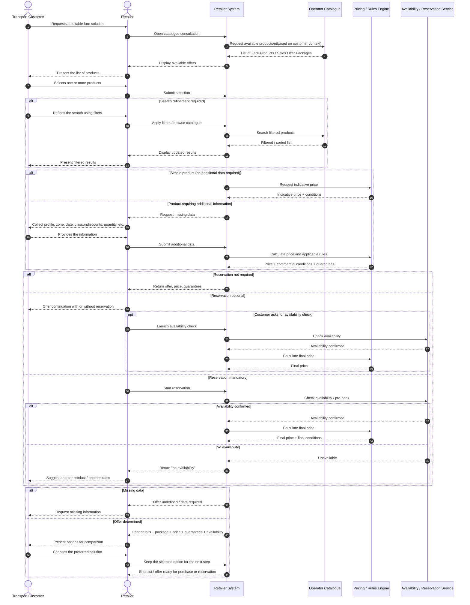

## Part 1 : Use Case Overview

- **Business Use Case ID & Name:** BUC1 — Choice of a solution by FARE PRODUCT catalogue consultation
- **Goal (Objective):** Enable the Transport Customer to select the most suitable fare solution by consulting the Fare Product catalogue and providing the information required to determine the best offer (product, package, price and guarantees).
- **Scope:** Offer discovery / catalogue consultation (FARE PRODUCT catalogue)
---

## Part 2 : Actors & Context

- **Primary Actor:** TRANSPORT CUSTOMER (represented by the retailer (FARE PRODUCT RETAILER role))

- **Supporting Actors / Stakeholders:**
  - **Retailer (FARE PRODUCT RETAILER role(API consumer)):** supports the customer and initiates catalogue consultation
  - **Operator (FARE PRODUCT DISTRIBUTOR role):** provides the FARE PRODUCT catalogue, prices, availability and guarantees

- **Assumptions (context at start):**
  - The retailer is authorised to consult the operator’s FARE PRODUCT catalogue.
  - The catalogue and related pricing/guarantee information are available (online service or accessible dataset).
  - The customer can provide the additional information required to compute/confirm the best offer.

- **Diagram:** :

---

## Part 3 : Preconditions & Postconditions

- **Preconditions (must be true before start):**
  - Access to the operator’s FARE PRODUCT catalogue is available to the reseller.
  - The relevant catalogue (for the operator/network/area) is identified.
  - Basic travel intent is known (at minimum: the customer wants to travel; optionally: zone/route/date/passenger profile).

- **Postconditions — Success guarantees:**
  - One or more candidate offers are identified, including:
    - selected **FARE PRODUCT(s)** and **SALES OFFER PACKAGE(s)** (if applicable)
    - the associated **Price**
    - applicable **Travel Guarantees / conditions**
    - **availability** information (where applicable)
  - The selected option (or shortlist) is available for the next step (e.g., purchase/booking).

- **Postconditions — Minimal guarantees:**
  - If no suitable solution is found, the customer receives a clear “no matching offer” outcome (with a reason where possible).
  - The consultation outcome can be logged/audited (if required by the system).

---

## Part 4 : Main Success Scenario (Happy Path)

- **User actions:** « list » :

1. The reseller opens the operator’s **FARE PRODUCT catalogue** for the customer.
2. The system displays the list of available catalogue items relevant to the customer’s context.
3. The customer (via the reseller) reviews the product list and selects one or more catalogue items.
4. The reseller captures additional information required to determine the best offer (e.g., passenger profile, eligibility/discounts, validity zone, dates, quantity).
5. The system retrieves and/or calculates the corresponding **price**, including applicable rules and conditions.
6. The system provides the offer details, including **SALES OFFER PACKAGE** options (if applicable), **travel guarantees/after-sales conditions**, and **availability** where relevant.
7. The reseller presents the results to the customer for comparison and selection.
8. The customer chooses the preferred solution (or requests a shortlist for the next step).

- **Sequence diagram:**

---

## Part 5 Alternative Flows (Variants)

- **A1 — Customer refines the search using filters** (Condition: The initial catalogue view does not show a suitable product.)
  - Change at Step 2: The customer navigates through catalogue pages and/or applies pre-defined filters (operator, locally usable products, popularity, marketing priorities).
  - Outcome: The system refreshes the displayed SALES OFFER PACKAGEs until a suitable one is found.

- **A2 — “Simple” product (no additional data required)** (Condition: The selected SALES OFFER PACKAGE is simple, e.g., an immediate single ticket.) 
  - Change at Step 4: No additional information is needed; the system can provide an indicative price immediately at selection time.
  - Outcome: The customer can compare/choose with an immediate indicative price.

- **A3 — Product requires additional customer inputs** (Condition: The selected SALES OFFER PACKAGE is not fully defined.)
  - Change at Step 4: The system prompts for missing information (e.g., time of travel, seating class, railcard).
  - Outcome: Once provided, the system completes the product definition and updates price/conditions accordingly.

- **A4 — Reservation optional vs mandatory** (Condition: The product definition states reservation is not needed / optional / mandatory.)
  - Change at Step 6: If optional, the customer may proceed without reservation (indicative price) or start reservation for availability/final price; if mandatory, reservation is required to obtain availability and final price.
  - Outcome: Either an indicative price is provided early, or a reservation flow is initiated to confirm availability and final price.

---

## Part 6 — Exception Flows (Errors)

- **E1 — No availability during reservation** (Condition: Reservation is started and availability is not confirmed: quota full / no seats.)
  - System behaviour: The system indicates “no availability”.
  - Result: The customer changes an option (e.g., comfort class) or selects another FARE PRODUCT / SALES OFFER PACKAGE. 

- **E2 — Offer remains undefined due to missing data** (Condition: Required parameters are not provided, e.g., class, railcard.) 
  - System behaviour: The system cannot compute a final offer and prompts the customer to provide the missing data or choose a different product.
  - Result: Failure to compute final offer until missing parameters are provided (or alternative product chosen).

---

## Part 7 — Business Rules

- **BR1:** Catalogue presentation rules: products may be ordered by network, zone, product type, popularity, local usability, marketing rules, or operator/platform priorities.
- **BR2:** Usage parameters: travel conditions can include interchange allowance, break of journey, validity duration, etc. 
- **BR3:** Commercial conditions: rules may apply for exchanging, refunding, cancelling, reserving, etc.
- **BR4:** Optional paid parameters: some parameters may be optional but available at an additional price (e.g., different luggage allowances).
- **BR5:** Reservation rule: reservation can be not needed / optional / mandatory depending on the SALES OFFER PACKAGE definition.
- **BR6:** Pricing rule:
  - Without reservation or without additional data, an **indicative** price may be provided early.
  - With reservation, the customer obtains the price for a completely defined Travel Package (final price after availability).

---

## Part 8 — Data (Inputs & Outputs)

- **Inputs (source → data):**
  - Customer/channel → FARE PRODUCT / SALES OFFER PACKAGE selection (catalogue item).
  - Customer/channel → Additional defining data when needed: time of travel, seating class, railcard/reduction cards, and other usage parameters.
  - Customer/channel → Reservation/availability parameters (when applicable): quota vs seat selection on a map for scheduled journeys.
  - Customer/channel → Optional extras selection (e.g., luggage allowance option).

- **Outputs (recipient ← data):**
  - Customer/channel ← List of SALES OFFER PACKAGEs and detailed information (network/lines/stops/connections).
  - Customer/channel ← Travel conditions and commercial conditions (exchange/refund/cancellation/reservation rules).
  - Customer/channel ← Availability result (if reservation process is started).
  - Customer/channel ← Price: indicative (early) and/or final price (after full definition and availability when relevant).

- **Stored / persisted information (if any):** Consultation outcome may be logged/audited (if required by the system).

---

## Part 9 — Interfaces / API / user-actions

- **Operations / Endpoints:** Catalogue consultation; search within catalogue; get offer/package details; get indicative price; start availability/reservation; get final price; update selection/options.

| Format-origin | API name or User action                                                      | Short description                                                                                                                    |
| --------------------- | --------------------------------------------------------------------------- | ------------------------------------------------------------------------------------------------------------------------------------ |
| Ticketing (example)   | **Catalogue consultation**                                                  | Retrieve/present Fare Products and Sales Offer Packages, with filtering and ordering.                                              |
| OSDM (example)        | **Search within catalogue (user: “Search a product”)**                      | Query the catalogue using keywords/filters (operator, local products, popularity, marketing priorities, etc.).                      |
| OSDM (example)        | **Get offer/package details (user: “View product details”)**                | Return the selected package’s full content: usage parameters, commercial conditions, guarantees, optional parts and selection rules. |
| OSDM                 | **Get indicative price (user: “Check price”)**                              | Provide an indicative price when the package is sufficiently defined and no reservation/availability confirmation is required.      |
| OSDM (example)        | **Start availability / reservation (user: “Check availability / Reserve”)** | Initiate an availability check (quota or seat map) and, where applicable, create a short-term pre-reservation.                      |
| OSDM (example)        | **Get final price (user: “Confirm price after availability”)**              | Return the final price for the completely defined travel package, typically after availability/reservation confirmation.             |
| OSDM (example)        | **Update selection / options (user: “Change class / add options”)**         | Recalculate conditions and prices when the user changes defining parameters (class, railcard, extras such as luggage allowance).    |
| BoB (example)         | **Catalogue consultation (user: “Browse offers”)**                          | Equivalent capability in BoB-style APIs: consult available fare products/packages and their conditions.                              |
| BoB (example)         | **Availability & pricing (user: “Validate availability and price”)**        | Equivalent capability in BoB-style APIs: check availability (if relevant) and return price/conditions for the chosen package.       |

- **Pagination rules:** Not specified in the source use case.
- **Error handling:** Main error cases described in Part 6 (no availability; missing required data).

---

## Part 10 — Non-functional Requirements & Traceability

- **Performance:** Indicative prices should be available early when possible; reservation flows should return availability and final price promptly to support customer choice.
- **Security & privacy:** Reseller must be authorised to consult the operator’s Fare Product catalogue; data minimisation implied by requesting only needed parameters.
- **Availability:** Catalogue and pricing/guarantee information should be available (online service or accessible dataset).
- **Auditability:** Consultation outcome can be logged/audited (if required).
- **Accessibility / usability:** The catalogue should be organised to be easy to use (clear pages, filters, prioritisation rules).
- **Related use cases:** Not specified in the source use case.
- **References / Origin:** Use case derived from the EUDIT repository entry “6.5.2.1 catalogue offers” and CoRoM.
- **Open points:** Not specified in the source use case.
