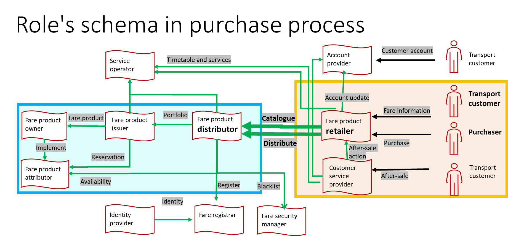
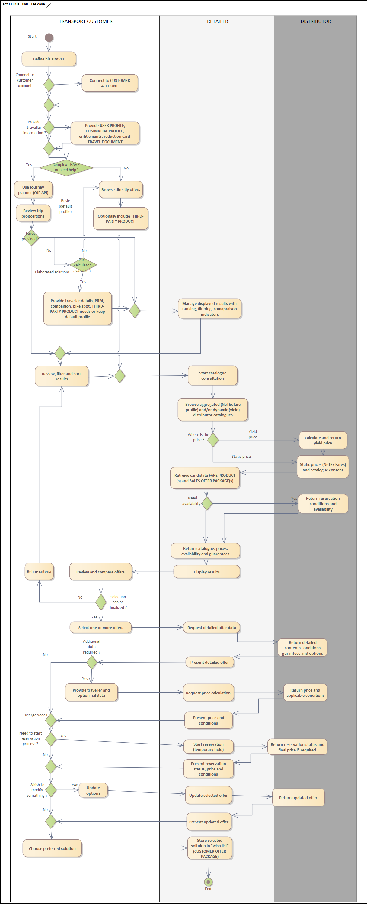

In review – version 3
## Use Case Overview
- **Business Use Case ID & Name:** BUC-A — Plan your trip by providing your selection criteria and choose the most suitable offer 
- **Goal (Objective):** Enable the traveller (or an assisted agent) to define clear selection criteria and then to choose the most suitable travel offer, with transparent pricing, sales conditions (exchange/refund rules) and travel guarantees. 
- **Scope (Summary) :** 
  - Capture the traveller’s **selection criteria** (modes, route preference, flexibility level, passenger needs). 
  - Retrieve and present **matching options**. 
  - Let the traveller **filter/compare** options. 
  - Provide **price** (indicative or final as needed). 
  - Show clearly: **sales conditions** (exchange/refund rules) **separately from travel guarantees**. 
  - Output: a **chosen option or shortlist**, or “no matching offer”. Offer discovery (journey planner proposals) / catalogue consultation (FARE PRODUCT catalogue) / PRICE calculation / CUSTOMER PURCHASE PACKAGE constitution

## Roles (schema in Roles for Business Use cases_v1.pptx )

## Terminology notes —
**Catalogue**: a customer-context proposal with a price, conditions and guarantees (not a list of individual products). In Transmodel terms, this corresponds to a (CUSTOMER OFFER PACKAGE), traceable to underlying components such as (FARE PRODUCT(s)) / (SALES OFFER PACKAGE(s)) when relevant.

**Fare calculator / pricing engine** (implementation note): In this document, “fare calculator” refers to an implementation component (often on the Distributor side) used to compute prices based on route and Customer parameters. It is not a standardised EUDIT component. In the EUDIT scope, the Retailer requests priced offers and the Distributor returns the priced offer options (price, conditions, and availability where applicable), regardless of the internal pricing engine used.

**Offer**: a customer-context proposal with a price, conditions and guarantees (not a list of individual products). In Transmodel terms, this corresponds to a (CUSTOMER OFFER PACKAGE), traceable to underlying components such as (FARE PRODUCT(s)) / (SALES OFFER PACKAGE(s)) when relevant.

**Travel guarantees** (aligning the wording with the Passenger Rights Regulations (PRR): Travel guarantees include the passenger-rights-related commitments applicable to the offer (e.g. re-routing/assistance/compensation principles when relevant), as well as any additional commercial guarantees provided by the Distributor/Retailer. The detailed legal obligations and jurisdiction-specific rules remain out of scope here; this BUC only requires that the applicable guarantees are made visible and selectable/comparable at offer selection time.

> **Comment (Bourdelin, Sonia, 2026-05-29):**
> TO REVIEW

## Actors & Context
- **Context**: This use case describes **the pre-purchase offer discovery** phase for ground transport. It focuses on how a **Retailer** helps a **Customer /Traveller** identify suitable travel options by interacting with one or more **Distributors/Operators** and presenting comparable results. It does **not describe the retailer’s end-customer user interface** in detail, and it does **not cover non-ground content** such as flights, hotels or car rental.
- **Primary Actor: Customer** (end customer) (TRANSPORT CUSTOMER ROLE and PURCHASER ROLE**) :** the person who expresses the needs and makes choices to purchase offers suited to travel needs. He can act for one or several Travellers (be the manager of a group, a PRM, the purchaser for a minor traveller or other with specific needs or none). The Customer may also be the traveller (i.e. the person who will actually travel and use the entitlement) (PASSENGER ROLE).
- **Supporting Actors:**
  - **Retailer (**FARE PRODUCT RETAILER ROLE) (API consumer): supports the Customer queries, initiates catalogue consultation, aggregates and presents options and support comparison (ranking / filtering). See Role schema: orange rectangle on the right)
  - **Distributor** (FARE PRODUCT DISTRIBUTOR ROLE) (API provider): provides the data and content to build timetable, fare catalogue, prices, availabilities, and guarantees.

## Preconditions & Postconditions
- **Assumptions and Preconditions (must be true before start):**
  - Commercial agreements are in place: Access to the Distributor’s catalogues are available to the Retailer. Some offers may be restricted.
  - The relevant content (for the distributor/network/area) sources are identified: the Retailer can determine which Distributor(s) to query for the requested trip (this may involve one or several sources depending on the journey).
  - The catalogue exists and is available as a pre-loaded/static reference dataset; availability and final price confirmation (when required) are performed through the responsible Distributor systems.
  - The Customer/Traveller can provide the minimum additional information required to propose relevant options (e.g. origin/destination or travel area, timing/frequency, passenger profile/eligibility, preferences) the best offer
  - Basic travel intent is known (at minimum: the customer wants to travel; optionally: zone/route/date/passenger profile), focused on ground-transport distribution.
  -  **T**hird-party products may be included only when they are distributed through the same Distributor(s) in scope (i.e. provided as part of the Distributor’s content/offers). Third-party products delivered outside that distribution scope are not covered here.
- **Postconditions — Success guarantees:**
  - The Customer receives one or more candidate offers proposed by the Retailer and sourced from one or more Distributors (shortlist: CUSTOMER OFFER PACKAGE(s)).
  - For each candidate offer, the Customer can see:
    - offer content and his packaging (FARE PRODUCT(s), SALES OFFER PACKAGE(s))
    - the associated price (PRICE), including any purchase validity/time limit.
    - applicable travel guarantees (TRAVEL GUARANTEE(s)), 
    - the applicable conditions, including:
      - validity constraints (e.g. zone, time window), 
      - eligibility requirements (e.g. reduction card, corporate entitlement), 
      - combination/combinability rules (e.g. outward must be part of a return trip), 
      - and after-sales conditions (exchange/refund/cancellation). (VALIDITY CONDITION(s), ENTITLEMENT(s), OFFER RULE(s), USAGE PARAMETER(s): EXCHANGING / REFUNDING / CANCELLING),
    - availability information (where applicable) (e.g. mandatory reservation, remaining capacity). (AVAILABILITY CONDITION)
  - The Customer selects a preferred offer or many (or shortlist of offers; available for the next step (e.g., purchase/booking) ().
- **Postconditions — Minimal guarantees:**
  - If no suitable solution is found, the Customer receives a clear “no matching offer” outcome (with a reason where possible).
  - If no suitable solution is found, the Retailer or Distributor may provide alternative offers. 

## Scenarios
### Main scenario
- **Express the need**
1. The Customer is planning the travel (TRAVEL), which can be composed of one or more trips (TRIP(s)), each consisting of one or more legs (LEG(s)). The Customer wants to travel from an origin place (TRIP ORIGIN PLACE) to his destination place (TRIP DESTINATION PLACE) using public transport and, optionally, return to the origin place (PLACE can be a POINT, a SECTION or a ZONE). Any discontinuities (‘gaps’) between trips are not managed by this BUC by default; however, a Distributor may propose an end-to-end offer and/or a connection protection mechanism to cover such gaps (e.g. a combined offer or a travel guarantee for connections), in which case it is presented as part of the returned offer. The Customer provides selection criteria to the Retailer (for one or several Traveller**(s)**): timing/frequency, preferred modes, route preference (fastest/cheapest/greener), flexibility level (refund/exchange constraints), accessibility needs, and any other criteria needed to identify relevant options.
2. The Customer may or may not connect to a customer account (CUSTOMER ACCOUNT) on digital platform of the Retailer, of a Distributor or another party. The Customer may request or prove eligibility for a particular passenger profile (USER PROFILE) (under 25 years old, PRM indications, corporate participation, companion, bike spot). The Customer may apply for a particular commercial profile (COMMERCIAL PROFILE). Relevant eligibility elements may already be registered or may be provided during the consultation (transport card, reduction cards, entitlements, vehicle plate, driving licence). The Customer can indicate that he wants to include associated offer (THIRD-PARTY PRODUCT) in the solution (example: museum entry)
- **Select the right content sources**
3. The Retailer determines which Distributor**(s)** to query (one or many), according to coverage (network/area/operators/commercial brand) and commercial/access rules. The Retailer then requests content to retrieve an initial set of candidate options.

> **Comment (Bourdelin, Sonia, 2026-05-29):**
> Ok

- **Retrieve candidate offers (two entry points)**
Depending on the context, the Retailer may obtain candidate options through two entry points (the orchestration is the same; only the starting input differs):
4. **Trip-based entry (journey planner result as input)**
- When the travel is not straightforward or if the Customer does not know how to make his travel or wants route suggestions, he can use a journey planner to compute possible routes and connections whether or not it is populated with the information from an account (CUSTOMER ACCOUNT), such as passenger profile attributes (e.g. age band), eligibility/entitlements (e.g. reduction rights, corporate profile), accessibility needs, preferred fulfilment medium (when it impacts eligibility), and party composition (number and type of travellers). It gives one or more results with details: schedule, transport modes, lines, stops, and connections (TRIP PATTERN(s)).  

- The journey planner may be associated with a fare calculator based on the selected route(s) and the Customer/Traveller parameters, the fare calculator returns priced offer/options for that route (PASSENGER FARE OPTION) (from basic default assumptions to more tailored results using eligibility, reductions, accessibility needs, corporate traveller profile/entitlements (when applicable), loyalty attributes (when applicable) and guarantees (TRAVEL GUARANTEE(s)). It may also indicate any availability constraints when relevant (AVAILABILITY CONDITION) (combined ticket, multimodal offers, with reduction and guarantees, including passes already purchased) and may display availability of some assets or mandatory reservations.  
  
- If the journey planner is not associated with a fare calculator, the Customer may be provided with a fallback to continue outside EUDIT (for example, redirecting the Customer to an external sales channel for the relevant segment), which is equivalent to the catalogue-based entry but outside the EUDIT flow.  
  
 
5. **Catalogue-based entry (catalogue browsing as input)**
Catalogue consultation is a Retailer/Distributor sourcing mechanism used to retrieve candidate offers; it does not imply that the Customer is manually selecting individual fare products.
- The Customer can browse one or more catalogues on a digital platform, go to a travel agency, a distributor desk, a ticket vending machine in a station or any distribution channel to request and compare offers proposed by the Retailer. The Customer may express preferences (e.g. mode, comfort, flexibility), but the Retailer presents priced offers returned by Distributor(s), and the Customer selects among those offers. He wants to choose by himself between offers, choosing himself the transport modes and the prices he is willing to pay. He can also include additional offers (THIRD-PARTY PRODUCTs) in his search when they are distributed through the same Distributor(s).
  
- Either the Customer or the Retailer on behalf of the Customer ask the Retailer for offers matching their criteria. The Retailer browses one or more catalogue to retrieve an initial set of candidate offers and presents an initial list. This catalogue exists as a reference static dataset (which may result from aggregation and harmonisation of one or more Distributor catalogues). When needed, this reference catalogue may be complemented or refreshed through real-time requests to Distributor(s), for example to retrieve up-to-date content or to confirm pricing and availability constraints.
  
- The Customer reviews the initial results and may filter or order the offers. When the Customer selects an item, the Retailer requests the priced option for the Customer’s specific context and parameters and receives the corresponding conditions and guarantees (TRAVEL GUARANTEE(s)). 
If the Customer cannot finalise the selection (e.g. distributor unreachable/timeout, partial content returned, eligibility evidence missing or rejected, quote validity/Time Limit expired, availability change during selection, inconsistent constraints across distributors), the Customer refines the search criteria, and the Retailer refreshes the catalogue results accordingly (e.g. by updating the context data and/or any constraints coming from the journey planning input). The updated results are then re-filtered and re-ranked to narrow down the list of candidate offers.
- **Present an initial set of comparable offers**
6. In both cases, the Retailer orchestrates the exchange with one or more Distributors and consolidates responses into a consistent list of comparable options, including price (PRICE), sales conditions and combination constraints (USAGE PARAMETER(s), VALIDITY CONDITION(s), ENTITLEMENT(s), OFFER RULE(s)), travel guarantees, and availability where applicable. The Retailer can manage (filter/rank/compare in a consistent comparison frame so the Customer can compare like-for-like) the displayed results with additional attributes provided by the Distributor(s) (operator, line, categories, product name) : fare/price, sales conditions (exchange/refund/cancellation), duration, number of interchanges, mode mix, GHG/CO₂ impact, comfort, accessibility or operator (CUSTOMER PURCHASE PACKAGE). The Retailer also supports comparison of corporate/private fares when eligibility is provided, and may display included/optional ancillaries and services (e.g. seats, luggage) as part of the option content. Where options involve multi-operator or multimodal pricing, the Retailer presents any validity, eligibility and combination/combinability constraints explicitly (e.g. outbound must be part of a return trip, zone validity, required reduction card) (PRICE/FARE PRICE, USAGE PARAMETER(s), VALIDITY CONDITION(s), ENTITLEMENT(s), OFFER RULE(s), TRAVEL GUARANTEE(s)).

- **Consult offers details ( for a selected candidate offer )**
7. The Customer selects one candidate offer and requests details so that he can consult the detailed contents, conditions, guarantees, and optional parts. This consultation can be done for more than one offer at the same time, if they can be displayed on the same screen at the same time. The Retailer retrieves the detailed information from the relevant Distributor(s) and presents it in a consistent way.
8. If the selected offer cannot be confirmed for the specific customer context, the Customer enters additional customer parameters by providing the required information, such as the traveller profile, eligibility, accessibility needs, class, date, zone, quantity, or extras (ACCESS RIGHT PARAMETER(s), USER PROFILE, ENTITLEMENT(s), CLASS OF USE). Once the required information is filled in, the Retailer checks the entries, updates the customer context (adds the missing parameters) and requests confirmation from the relevant Distributor(s). The Distributor(s) then either confirm the offer (price/conditions/availability) or reject it if the provided inputs do not satisfy eligibility or other constraints. The Customer is informed with a price with the applicable commercial and travel conditions: 
- sales and aftersales conditions including exchange, cancellation or refund conditions (USAGE PARAMETER(s): EXCHANGING / REFUNDING / CANCELLING), 
- travel guarantees (TRAVEL GUARANTEE(s)) including passenger rights when applicable, 
- availability information (AVAILABILITY CONDITION), 
- third-party products only when included in the Distributor-provided content. 
It may be composed of several items. 
9. a. If this price is indicative and depends on mandatory reservation (for example, a seat (SPOT ALLOCATION)), or if the Customer wishes to check availability and the system allows it, or if confirming the chosen option requires locking capacity (seat/quota) or starting a time-limited hold/pre-reservation, this is handled in the Reservation BUC-C.  
- If the final price is a dynamic/yield price, the Distributor returns a price with a limited validity period (validity/TTL). The Retailer informs the Customer that this price may expire; if it expires before the Customer proceeds, the Retailer must request a refreshed price and updated conditions from the Distributor before continuation.    
- **Refine and re-evaluateoffers**
10. If the Customer cannot finalise his selection, he adjusts the criteria and/or defining parameters to narrow/change the displayed offers according to the consultation context and the data he provides (new or modified data and/or data coming from journey planner requirements). The Retailer refreshes the option(s) by re-querying the relevant Distributor(s). This can iterate until the Customer is satisfied or no option matches. If the Customer wants to collect and manage several options/products together (iterate BUC-A several times, assemble a basket), this is handled in BUC-B (basket management) (TRAVEL BASKET / TRAVEL PACKAGE).
- **Selection**
11. The Customer chooses the preferred solution (or a shortlist). The Retailer records the consultation outcome as the selected option/shortlist (CUSTOMER OFFER PACKAGE) . The retailer can inform the Customer that all or part of the offer has expired and propose a new price and availability calculation when applicable.

### Alternatives scenarios
Alternative scenarios **fully compatible** with the main scenario; using shortcuts or very detailed specific points of the main scenario.

- **Specific trip**
1. The Customer chooses his origin station and his destination station, optionally using a "around me/ the stations: x kilometres" (a nearby/radius option around the stations. (PLACE as POINT/SECTION/ZONE)). 
2. The Customer enters required data (customer account, reduction card) (CUSTOMER ACCOUNT optional, ENTITLEMENT(s)).
3. The Customer chooses between a few offers displayed with their price, on different travel options with different stations (radius-based).

- **Single anonymous travel**
1. The Customer starts his mobile application/distribution channel; the entry point can display a shortcut for single-trip purchase “in one action” (i.e. with minimal input) (CUSTOMER ACCOUNT optional).
2. The Customer chooses an anonymous single-trip ticket by using this shortcut (default assumptions may apply: anonymous adult, single trip, no reduction) (USER PROFILE default, TRAVEL SPECIFICATION minimal). 
3. The Retailer requests and displays the priced offer with sales conditions and travel guarantees (PASSENGER FARE OFFER, PRICE, USAGE PARAMETER(s), TRAVEL GUARANTEE(s)). 
4. If an availability check or a time-limited hold is required, it is handled in **BUC-C**. (AVAILABILITY CONDITION, SPOT RESERVATION / SPOT ALLOCATION) 
5. If the Customer purchases, it is handled in **BUC-D**. (PAYMENT)

- **PRM journey**
 1. The Traveller(s) have specific needs that must be guaranteed to be met during the travel (on each leg and between legs, during connections). The journey planner gives solutions that meet the travel specification with mobility services even on the first leg (from house/postal address to first stop point), during interchange and on the last leg (from last stop point to final destination) (TRAVEL SPECIFICATION, LEG(s)).
2. If the journey planner is associated with a fare calculator, the Customer receives an offer compliant with passenger profile and with the travel specification, including continuous additional services and travel guarantees from house to destination (USER PROFILE, PASSENGER FARE OFFER, TRAVEL GUARANTEE(s)).
3. If the journey planner only provides basic mobility solutions, the Customer browses the catalogue to select one by one the required tickets/services/guarantees. When his selection fulfils his complete travel, he has a satisfactory solution. If this requires combining several items, it is handled in BUC-B (TRAVEL BASKET / TRAVEL PACKAGE).

- **Return trip**
 1. The Customer plans a travel composed of an outward journey and the corresponding return journey. The journey planner can manage the full travel, requesting only minimal criteria for the return trip (return time and reversing origin-destination) (TRAVEL, TRIP(s)).
2. If an integrated fare calculator is available, it may produce an initial indicative priced offer based on the result of the journey planner: , the Customer can receive an offer that considers the whole travel (for example, a daily pass less expensive than two separate tickets) (PASSENGER FARE OFFER, PRICE).
3. If the journey planner only proposes basic mobility solutions, the Customer browses the catalogue to select one by one the tickets, looking for a solution that includes the two trips. If this requires assembling multiple selected items, it is handled in BUC-B (TRAVEL BASKET / TRAVEL PACKAGE).

- **Bank card as TRAVEL DOCUMENT**
 1. The Customer plans a travel and consults the catalogue: he checks that his bank card is accepted as a travel credential on the selected journeys. The validity conditions, guarantees and prices (including fees and VAT rates) are displayed. The Customer is fully informed (TRAVEL DOCUMENT, VALIDITY CONDITION(s), TRAVEL GUARANTEE(s), PRICE).
2. The Customer does not need to select a product himself: the offer selection is done by the system when the traveller taps on the validator equipment (date and time, place, line, stop, operator, bank contract and answer, customer account) (FARE PRODUCT, CUSTOMER ACCOUNT optional).
3. This alternative may end at the information stage in BUC-A when no retailer-led purchase is performed.

### Diagram
UML activity diagram

> **Comment (Bourdelin, Sonia [2], 2026-04-30):**
> To update

### Links with use cases
Link to (https://github.com/TransmodelEcosystem/EUDIT/discussions/36#discussioncomment-16183779)  
To be completed
