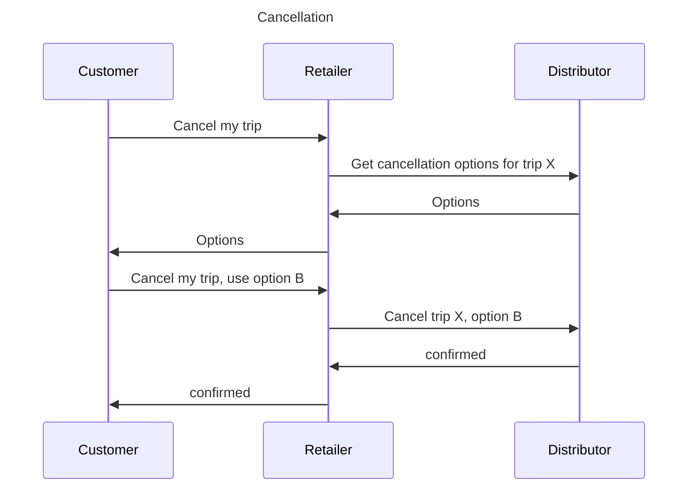
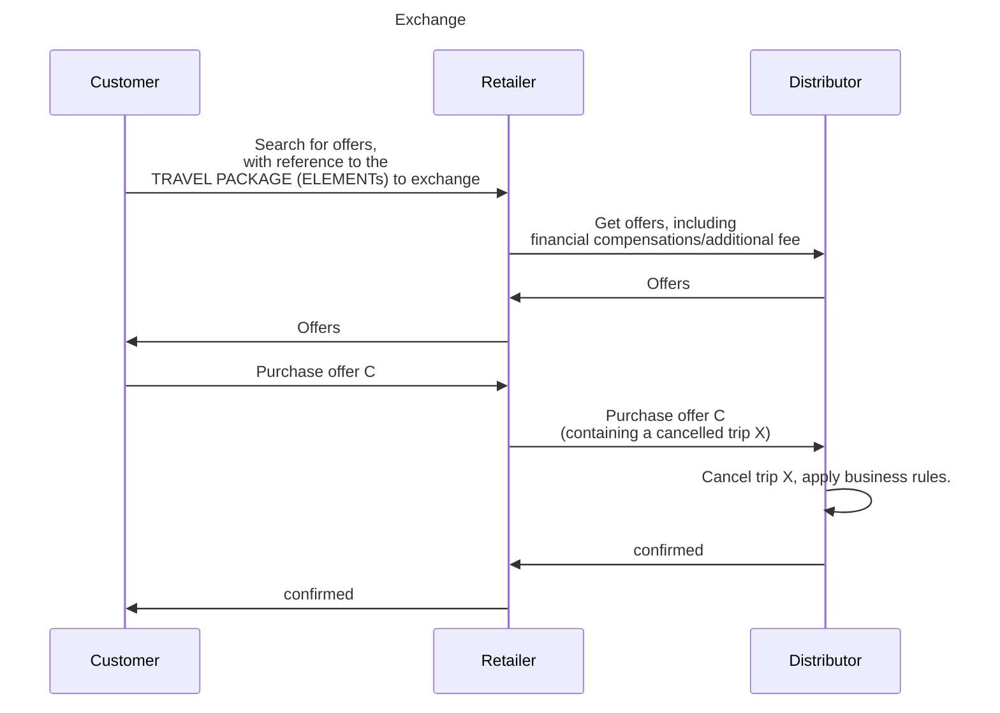

## Use Case Overview (draft)

- **Business Use Case ID & Name:** BUC-F — Pre-Trip 
- **Goal (Objective):** 
The customer wants to check travel conditions and to modify his transport contract (ticket) before traveling.  
Or the customer wants to add offers to his trip.  
Or the customer is notified by the retailer that his trip has been modified by one or several operators.  

BUC-F focuses on pre-trip servicing actions around existing transport contracts (cancel/exchange/cross-sell) and operator-initiated changes.
All other operations not directly related to a future travel are managed by BUC-J (voucher lifecycle, claims, no-show, account/support lifecycle actions, contract suspension/blacklist, ABT security invalidation, management of NFC smartcard…).

## Scope
- (Partial) exchange (also used to Upsell)
- (Partial) cancel  / release
- Retrieve transport contract and related aftersales conditions 

So, not in scope: 
- Notification of change made by the operator (BUC - N) 
- Disruption information (BUC - ? realtime information, SIRI?)
- Cross-selling (adding additional (mainly) ancillaries) should be covered in the 'amend' phase (BUC-B Shop & price).
- Details of financial compensation will be described in BUC-D or BUC-J, we'll only reference here.
- Revocation and other operations on the travel documents (operations on the travel documents) will be described in BUC-? 
- Claiming redresses (based on guarantees), BUC-J

## Terminology notes 

**Transport contract**: the contract between the Distributor and the Customer to consume mobility services ((indirectly) provided by the Distributor) against payment (provided by the Customer). It can be represented by a TRAVEL DOCUMENT.

**Ticket**: a kind of TRAVEL DOCUMENT

**Travel Right**: a right to travel, assigned to a Traveller, supplied by an Operator

Aftersales actions when available:
- **Cancel** (1-step cancel): the transport contract (or part of it) is cancelled independently of any new wish of travel and customer who initially paid is refunded by the retailer in accordance with the fare conditions for that transport contract. In case of reservations on the original transport contract, the allocated seats/resources are released for reuse by other travellers.
- **Release** (2-steps cancel): before the departure the customer signals to a retailer, which is not the retailer that has done the original purchase (usually the sales office of the operator), that the allocated seats/resources may be released for reuse by other travellers. This action will preserve the fare conditions based on pre-trip conditions for subsequent assessment. It enables also the cancelation to be processed and approved after the trip, when the customer goes back to the retailer that has done the original purchase, in accordance with the fare conditions for that transport contract.
- **Upsell**: kind of exchange where the travel intention is unchanged, but the customer wants to travel with higher comfort (e.g. 2nd class à 1st class in rail).
- **Cross-sell**: addition of offers bound to the initial transport contract. Most of the time, the customer is suggested to purchase these additional offers by the retailer or the distributor or the operator. These booked offers are part of the trip.
- **Exchange**: exchange operations (change date, time, route, or class) without requiring an independent cancelation + rebook process. For the exchange operation, the original transport contract is part of the initial context of the request for a new offer. Cancel conditions and Exchange conditions can be different. In case of reservation bound to the original transport contract, the reservation is released only when a new reservation on the new trip is secured.

> **Comment (Bourdelin, Sonia, 2026-05-27):**
> It is the travel rights that are cancelled.  
_Answer (Edwin)_: it could be a partial cancellation (travel right, allocated seat, ancillary)  or a complete one  
> Do you want to manage here also the cancellation of the travel document ?  
_Answer (Edwin)_: Do you mean revoking tickets? In that case, I'd say, no. That's part of BUC-L : pre-trip.  
> My remark is the same for the others operation  : exchange of travel rights, of travel document or both
_Answer (Edwin)_: Even worse: travel right, allocations (seat reservation) and ancillaries should be addressed. And travel document operations like revokation, activation and deactivation should be addressed in another BUC (to be made, or to integrate in BUC-L).

> **Comment (Bourdelin, Sonia, 2026-05-27):**
> Refund/compensation instruments such as vouchers/credit notes, overpayment and their management are not detailed here; refer to BUC-J. >
_Answer (Edwin)_: yes. We only can refer here.

> **Comment (Bourdelin, Sonia, 2026-05-28):**
> The Distributor returns cancellation options/proposals (eligibility, fees, refundable amount) according to after-sales conditions. If reservation resources exist, their release is performed according to Distributor rules. Refund/compensation instruments are not detailed here; see BUC-D and BUC-J.
_Answer (Edwin)_: yes. We only can refer here.

> **Comment (Bourdelin, Sonia, 2026-05-28):**
> Is it part of cancellation that the contract must be pre-paid ? and the it must be refund (other possibilities ?)?
_Answer (Edwi)_: does it matter here? Wh_y?

> **Comment (Bourdelin, Sonia, 2026-05-27):**
> Release is covered here partially as a pre-trip operational action; 
> The end with any subsequent claim, eligibility assessment after travel, or dispute handling belongs to BUC-J.
_Answer (Edwin)_: yes..

> **Comment (Bourdelin, Sonia, 2026-05-27):**
> larger : facility, guarantees, ...

> **Comment (Bourdelin, Sonia, 2026-05-27):**
> Explicit that is is one customer demand with implication of 2 aftersales actions. 
> It is what will be done but in one transaction under the responsibility of who manages the exchange (retailer or distributor). The difference is who is taking the responsibility in case of failure somewhere in the process.

> **Comment (Bourdelin, Sonia, 2026-05-27):**
> Do you want to manage here the travel document exchange or only the travel rights exchange, and as consequence, the exchange of travel document. Add reference to BUC-J for travel document exchange
 
## Actors & Context

- **Primary Actors:**
  - **Customer** (TRANSPORT USER ROLE including TRANSPORT CUSTOMER ROLE and PURCHASER ROLE (represented by the retailer)): has access to the real time content of his transport contract or wants to modify transport contracts (or part of them).

- **Supporting Actors / Stakeholders:**
  - **Retailer** (FARE PRODUCT RETAILER ROLE (API consumer)): manages the search for the concerned transport contract and the related aftersales process, including the capture of customer new criteria, the aftersales flow with the distributor until the finalization of the aftersales, the refund in relationship with the PSP and the possible issuing of new travel documents. May suggest to the customer any additional offers or upgrades bound to his travel. May inform the customer that transport contracts have been changed by the operator. 

  - **Distributor** (FARE PRODUCT DISTRIBUTOR ROLE (API provider)): 
    * provides aftersales conditions and fare information to the retailer. 
    * Provides cancel / exchange /upsell / cross-sell offers and finalize the aftersales process or purchase of new offers process, including possible new reservations.  
    * Provides an updated view of transport contracts to the retailer, including if a transport contract has been changed by the operator.
    > **Comment (Edwin):** Does the operator cancel/exchange?

## Preconditions & Postconditions

- **Assumptions (context at start):**
  - Depending on the architecture of the systems, the transport contract can be recorded on distributor side or underlying actors (ABT / server centric) or can be standalone (CBT / document centric). 

> **Comment (Bourdelin, Sonia, 2026-05-27):**
> In urban transport, we have also a copy if the contactlesscard content on the system (in case of reconstitution, broken, ...) _Answer (Edwin): does this have an impact here?_

  - In case of change of the transport contract by the operator, this BUC doesn’t describe the railway’s duty imposed by the EU Passenger Rights Regulation (direct relationship between railway and traveller). What is described here is the information to the retailer by the distributor that a transport contract has been updated by the operator, and the retailer is free to use this event to notify also the customer. The important point is that based on the PRR, the operator must notify the passengers, whereas the retailer may notify the customer or any user of its front tools (e.g. retailer’s app).

> **Comment (Bourdelin, Sonia, 2026-05-27):**
> Not sure it is at the right place in this BUC. 
> This BUC manages the case when the Customer (that is or not a traveler) has been informed of a change. The customer must receive the best information about change impacting his travel rights. _Answer (Edwin): agree, remove here_
  - Post-payment services are not concerned by this BUC, since no payment has been done so far in that case. The customer can change his mind without needing of doing anything.

> **Comment (Bourdelin, Sonia, 2026-05-27):**
> it is usual to request a first payment at the subscription moment

> **Comment (BIGEX Olivier, 2026-05-18):**
> Maybe still cancel the subscription of the post-payment service ?

> **Comment (Bourdelin, Sonia, 2026-05-27):**
> Yes, post-payment subscription cancellation and related servicing (stop mandate, settle outstanding amounts, unblock access) are not detailed in BUC-F; add a reference to BUC-J for post-payment service servicing. _Answer (Edwin): remove the payment issues here_

- **Preconditions (must be true before start):**
  - Access to the distributor’s selling system is available/authorized to the retailer on behalf of the customer.
  - The relevant distributor(s) of the selected transport contract elements are identified.
  - The distributor’s selling system and related pricing, guarantee, after-sales and dependency information are available (online service or accessible dataset).
  - The customer has got a transport contract, issued as travel document.

> **Comment (Bourdelin, Sonia, 2026-05-27):**
> with or not relevant travel document(s)
  - The customer is in possession of the travel documents, or the travel document can be retrieved from a customer account. _Answer (Edwin): whether de travel documents have been issued is not relevant. There must be a purchased TRAVEL PACKAGE (the contract), that's the only requirement_

> **Comment (Bourdelin, Sonia, 05/27/2026):**
> In some cases, the travel document is issued only few days before he travel. The request here can be done before the issuing of the travel document; 
> In some cases, there is no document fulfilment (EMV) _Answer (Edwin): see my last remark_

- **Postconditions — Success guarantees:**
  - Cancel: the transport contracts are no longer active and cannot be used anymore. The seats/resources have been released. According to aftersales condition, the customer can be fully or partially refunded by the retailer. The settlement process can take this cancellation into account.

  - Exchange (including upsell): the initial transport contracts are no longer active and cannot be used anymore. They have been replaced by new transport contracts, and the customer has received new travel documents. The initial seats/resources can have been released and replaced by new seats/resources assignment (if available). According to aftersales condition and to the payment balanced, the customer can be partially refunded by the retailer (negative balance) or must pay a supplement (positive balance). The settlement process will take this exchange into account.

> **Comment (Edwin):** Hmmm. I understood that the big advantage of the exchange would be that claimed resources (seats) remain claimed in the new TRAVEL PACKAGE, when they still comply to the new request. Otherwise, you can easily skip the exchange and cancel the 'transport contract' and purchase a new one.

  - Cross-sell: one or several new offers has been booked (including reservations is available) and fulfilled and are part of the customer’s initial travel.

> **Comment (Edwin):** this looks like adding new offer (element)s. Isn't that part of BUC-B?

  - Change by the operator: the retailer is informed of the change of the transport contract and makes this information available to the customer.

> **Comment (Edwin):** That's BUC-N: notifications

> **Comment (Bourdelin, Sonia, 2026-05-27):**
> if it is relevant and according to customer rights

- **Postconditions — Minimal guarantees:**
  - If the customer abandons the process of Cancel/Exchange/Cross-sell or no suitable solution is found or no Cancel/Exchange can be done (not cancellable / not exchangeable), the initial transport contracts remain unchanged and valid. In case of reservations, they have not been released.

> **Comment (Bourdelin, Sonia, 2026-05-27):**
> depends... _Answer (Edwin): on what?_

  - Depending on aftersales conditions, the exchange request can be rejected 

## Scenarios

### Main scenario

> **Comment (Bourdelin, Sonia, 2026-05-28):**
> Add a precision : Primary object serviced here is the transport contract (travel rights). Travel documents may need to be re-issued/updated/invalidated as a consequence, according to Distributor rules and fulfilment processes (see BUC-E / BUC-J where applicable).

- **Retrieve a transport contract**

> **Comment (Bourdelin, Sonia, 2026-05-27):**
> The aftersales can be done on travel document also. Precise that here which case we manage
- The customer consults his available transport contracts.
  - The customer can show his travel documents to the retailer so that the retailer can read its content (barcode reader, NFC reader, direct entry by visual reading of the ticket media…) and collect references of the transport contracts and related retailer’s order and distributor’s booking. If the customer is connected to a customer account (and if the initial purchase has been made by this retailer), the information can be directly retrieved.

> **Comment (Bourdelin, Sonia, 2026-05-27):**
> If the sale has been done by another operator/retailer, the retailer only sees the data required for aftersales conditions application, not all the purchases, contracts history, ... _Answer (Edwin): isn't this up to the implementation?_

> **Comment (Bourdelin, Sonia, 2026-05-27):**
> particular case : delegated rights to the retailer to connect to customer account (the customer account can be on the retailer system, on the distributor system or on a third-party system)
> How connection to customer account is done is out of our scope.

  - Optionally, based on one single travel document, if the retailer has managed an order, then it can collect the references of all multi-distributor fare contracts (and related bookings) of the trip. 

> **Comment (Bourdelin, Sonia, 2026-05-27):**
> In anonymous case, the majority in urban transport _Answer (Edwin): what do you want to say here?_

> **Comment (Bourdelin, Sonia, 2026-05-27):**
> rights ?, authorizations ? 
> the retailer need at least keys to read the card or request the system (ABT) : security management _Answer (Edwin): out of scope here_

  - Based on these references `Question (Edwin): which references?`, the retailer requests the distributor to retrieve (if allowed) detailed information on the transport contract and on all transport contracts of the booking on distributor’s side, including aftersales conditions based on their current status. 

> **Comment (Bourdelin, Sonia, 2026-05-27):**
> to reformulate : it is the aftersales conditions status known by the distributor ? But in media base system, it is the status of the contract on the media that is taken into account

> **Comment (Bourdelin, Sonia, 2026-05-27):**
> depends on the architecture
  - In case of change of a transport contract initiates by the _operator?_(change of the vehicle configuration, planned route substitution, cancellation of the service journey…), the information about this change is made available to the retailer. It could be an update of the transport contract (e.g. update of the seat/resource assignment) or a new ticket transport contract which replaces the initial one. The customer can reissue his travel document with updated content. Depending to the reason of the change and the sales conditions, the customer can request a cancellation or exchange of the transport contract with bypass of the aftersales conditions.

> **Comment (Bourdelin, Sonia, 05/27/2026):**
> It is a second entry point of the use case. Not a d. point in contract search. Put this chapter at a highest level as a second trigger of the BUC.
> Please clarify with assumptions and PRR
> _Answer (Edwin): BUC - N: notifications_

> **Comment (Bourdelin, Sonia, 2026-05-27):**
> and sometimes directly to the customer (mobile applicaition) _Answer (Edwin): Nope, always to the backend of the Retailer_

> **Comment (Bourdelin, Sonia, 2026-05-27):**
> automatically proposed by R or D and with or without required C acceptance _Answer (Edwin): Please clarify R, D, and C_

> **Comment (Bourdelin, Sonia, 2026-05-27):**
> if required

> **Comment (Bourdelin, Sonia, 2026-05-27):**
> includes the reason of  the change I think

> **Comment (Bourdelin, Sonia, 2026-05-27):**
> may choose between different options. cancellation or exchange are managed in this BUC. Others are managed in BUC-J. _Answer (Edwin): agree_

> **Comment (Bourdelin, Sonia, 2026-05-27):**
> Unsupervised / mid-supervised aftersales operation are only done by authorized agents. Everything else is scheduled and parametrized.
- Based on search transport contracts, the customer can:
  -  Stop the BUC here.
  - Request a cancellation.
  - Request an exchange.
  - Add new offers to his travel. (See BUC-B?)

> **Comment (Bourdelin, Sonia, 2026-05-27):**
> e. all possibilities manages in BUC-J

- **Cancellation**
- The customer requests a cancellation of all his trip, or of a part of it (selection of transport contracts, legs, passengers, services).

> **Comment (Bourdelin, Sonia, 2026-05-27):**
> Do we cancel a whole or part of the pattern or also services, facilities, ...? Please clarify and we will manage what is not done here in BUC-J _Answer (Edwin): Cancellation & Exchange is here in scope, as well partial as full_
  - After having requested all concerned distributors, the retailer shows to the customer offers for cancellation, including price for refund and possible fees.

> **Comment (Bourdelin, Sonia, 2026-05-27):**
> It is not exactly in this way we use 'offer' in the project. Could you change by 'proposals', or another word ?
  - The retailer can apply authorisation codes ('overrule codes') that waive or reduce fees for cancellation. It is up to the distributor to accept them or not. _Answer (Edwin): Agree_.

> **Comment (Bourdelin, Sonia, 05/27/2026):**
> Please put the steps in the temporal order : add a step where the retailer request for the distributor for the cancellation conditions deleguated (to the retailer)
> Add precision if the authorization is/must be requested in real-time (additional step) and if there is an overrule
  - The customer is informed if transport contract cannot be partially cancelled.

> **Comment (Bourdelin, Sonia, 2026-05-27):**
> Enlarge : cancellation possibilities : full, partial, not allowed, with fees, ..
  - The customer is informed of all applicable rules of cancellation in full and in plain language so the customer can make an informed decision.

> **Comment (Bourdelin, Sonia, 2026-05-27):**
> c and d are the same step ? or it is done with 2 different ways and steps ?
  - The customer confirms the cancellation. If the transport contracts are stored in system, they are cancelled by the concerned distributors, and the travel documents are useless (can be destroyed if disposable). If the transport contracts are stored in an NFC smartcard, the card content must be successfully updated on an eligible device. If the transport contracts are stored on secured (paper) travel documents, the travel documents must be returned to the retailer.

> **Comment (Bourdelin, Sonia, 2026-05-27):**
> confirms he wants to cancel

> **Comment (Bourdelin, Sonia, 2026-05-27):**
> Not of the travel document can be used for many contracts (ABt achitecture or contactless card with more than 1 contract)

> **Comment (Bourdelin, Sonia, 2026-05-27):**
> MAny solutions depending on the D policy (see my comment below about travel document updates)

> **Comment (Bourdelin, Sonia, 2026-05-27):**
> If it happens (the card is caught by a validator) but not necessary

> **Comment (Bourdelin, Sonia, 2026-05-27):**
> or not

> **Comment (Bourdelin, Sonia, 2026-05-28):**
> Given examples help to understand but we need a global sentence : NFC, device are too restrictive : proof, reference, retieval method, travle document,...
  - Depending on the cancellation balance and retailer’s fees, the customer is refunded.

> **Comment (Bourdelin, Sonia, 2026-05-27):**
> We should manage somewhere a 'refund' chapter : in BUC-D in alternatives scenario of payment ?

> **Comment (Bourdelin, Sonia, 2026-05-27):**
> by the retailer

> **Comment (Bourdelin, Sonia, 2026-05-28):**
> Clarify between the customer desire (cancel trip) and the many ways of manage it by the retailer and the consequences (refund, ...). In most cases, it lets to a refund but can be many others consequences (voucher, redirect to Exchange, nothing happen, the group has a traveller less, my invoice will be recreased at th end of the month, ..
  - The settlement process will take this cancellation into account (see next BUC).

- **Exchange**

> **Comment (Bourdelin, Sonia, 2026-05-27):**
> For the EUDIT project, it could be interesting to split a in basic actions : an exchange is : 1 - a search with criteria / 2- a new reservation / 3- a cancellation / 4 - payment management / 5 - confirmation of the full transaction / 6- fulfilment of travel rights and if necessary travel document. It will help us to identify
- The customer requests an exchange of all his trip, or of a part of it (selection of transport contracts, legs, passengers, services). The exchange can be a reduction or addition of passengers, a change of trip (date, requested departure/arrival time, legs) or a change of level of comfort (potentially suggested by the retailer or the distributor).
  - The customer follows BUC-A, except that the initial transport contract(s) are part of the context of the offer request. 

> **Comment (Bourdelin, Sonia, 2026-05-27):**
> and critria for exchange are given : remain on same leg, same level of confort, same price, etc .... The seach engine must have which can be enlarged and which must be kept as a criteria.
  - The retailer can apply authorisation codes ('overrule codes') that waive or reduce fees for exchange. It is up to the distributor to accept them or not.

> **Comment (Bourdelin, Sonia, 2026-05-27):**
> Can you detail more the interactions between retailer and distributor as it si our subject in EUDIT ?

> **Comment (Bourdelin, Sonia, 2026-05-27):**
> 2 cases : the retailer manages the exchange as the new solution is from another operator (in France from Paris to Marseille, with Trainline, you can change from SNCF to Renfe)
> Or it is the distributor that manages the exchange as it is guaranteed is after sales conditions.

> **Comment (Bourdelin, Sonia, 2026-05-28):**
> two responsibility models
  - The customer is informed of all applicable rules of exchange in full and in plain language so the customer can make an informed decision.
  - The customer selects and confirms an exchange offer (BUC-C). The initial reservation(s) are released once the exchange confirmation is successful. 

> **Comment (Bourdelin, Sonia, 2026-05-27):**
> Confirmation is done in a second time : first the customer select a solution / the retailer-distributor tries to do it / the customer confirm with payment (zero, refund => see refund use case, new payment => BUC-D)

> **Comment (Bourdelin, Sonia, 2026-05-27):**
> Please detail the interactions between R and D and in the 2 cases (who manages the exhcnage)
  - Depending on the exchange balance and retailer’s fees, the customer can be partially refunded or must pay the difference (BUC-D).
  - The costumer gets new transport contract(s) with travel document(s) (BUC E). If the initial transport contracts are stored in system, they are cancelled by the concerned distributors, and the initial travel documents are useless (can be destroyed if disposable). If the initial transport contracts are stored in an NFC smartcard, the card content must be successfully updated on an eligible device. If the initial transport contracts are stored on secured (paper) travel documents, the initial travel documents must be returned to the retailer.

> **Comment (Bourdelin, Sonia, 2026-05-27):**
> can be or not (in Account base solution, change is done on the system, not on the document/ticket/QRCode)

> **Comment (Bourdelin, Sonia, 2026-05-27):**
> add :on the retailer request

> **Comment (Bourdelin, Sonia, 2026-05-27):**
> or erased (QRcode) or returned (smartcard) or others ways ... following ditributor policy

> **Comment (Bourdelin, Sonia, 05/27/2026):**
> UX dependant, too restrictive
> Enlarge the travel document management with at least the 3 cases I see : the document embed the travel rights => must be updated (immediately, delayed) / the document security must be updated (key with validity period by example) / the travel document doesn't need to be updated (ABT architecture). It can be sum up with : the D informs the R with the travel document needs for update or change (or nothing). 
> After, the updates can be done by the retailer, by the distributor or by a third party (operator on validator equipement)
  - The settlement process will take this exchange into account (see next BUC).
- 
- **Addition of new offers**
- The customer requests the addition of offers to his trip

> **Comment (Bourdelin, Sonia, 2026-05-27):**
> offer(s) or service or ancilliary, ... to his contract
  - The customer follows BUC-A, except that the initial transport contract(s) can be part of the context of the offer request (not mandatory, depending of the cross-sell product: adding an urban ticket is independent of any existing transport contract, whereas adding a seat reservation or a large luggage is bound to the initial admission). 

> **Comment (Bourdelin, Sonia, 2026-05-27):**
> commercial agreements between distributor(s) and retailer(s). The dependencies between offers can be part of the D data sent to R (commercial profil required, etc ..). But it could be (urban transport) the distributor that calculates the cohabitation rules and the dependencies and the final acceptance (or not) of the new offer
  - The distributor can apply support automatic journey continuation (AJC), re-pricing a journey when a customer extends travel beyond the originally booked destination. In that case, new transport contracts can concern the new offer and initial transport contracts.
  - The customer selects, confirms new offer(s) (BUC-C) and pays (BUC-D).
  - The costumer gets new transport contract(s) with travel document(s) (BUC E).

> **Comment (Bourdelin, Sonia, 2026-05-27):**
> or updated

> **Comment (Bourdelin, Sonia, 2026-05-27):**
> relevant
  - The new booked offers are included in the initial trip (depending of the booked offers, the aggregation is done by the retailer or the distributor).

> **Comment (Bourdelin, Sonia, 2026-05-27):**
> or not in the initial contract

> **Comment (Bourdelin, Sonia, 2026-05-27):**
> refers to BUC-E for fulfilment
  - The settlement process will take this exchange into account (see next BUC).

### Alternatives scenarios

> **Comment (Bourdelin, Sonia, 2026-05-28):**
> Can we manage additional alternatives cases or integrate it in the main scenario ? 
> - Partial cancellation not allowed / constrained
> - Cancellation or exchange requires revalidation because of time limits
> - Exchange rejected after attempt : the retailer has to manage the failure and to restart a exchange process
> - Multiple distributors in one trip: mixed outcomes
Independent alternative scenarios **fully compatible** with the main scenario; using shortcuts or very detailed specific points of the main scenario.

- **Simple CBT / document centric ticket withaftersales conditions included in shared dataset**
- After having retrieved transport contract information by reading the travel document, the retailer can inform directly the customer about aftersales conditions based on shared dataset of products. Then the customer can proceed to the Cancel/Exchange request, without asking the distributor previously for aftersales conditions on this transport contract.

> **Comment (Bourdelin, Sonia, 2026-05-28):**
> Even if it is the retailer that does the exchange directly, he has been informed and authorized previously. In any case, the retailer knows the aftersales conditions but can receive this information in real-time or asynchroneously

- **Release resources before departure**
- before the departure the customer signals to a retailer, which is not the retailer that has done the original purchase (usually the sales office of the operator), that allocated seats/resources for a transport contract may be released for reuse by other travellers, because he no longer wishes to travel.
- The customer is informed of all applicable rules of release offers in full and in plain language so the customer can make an informed decision.
- The retailer notifies the distributor of this first step of a cancelation for this transport contract, which is no longer usable for travel, without confirming the cancellation.

> **Comment (Bourdelin, Sonia, 2026-05-28):**
> + ressource release
- The retailer informs the costumer that he must finalize the cancellation with his initial retailer to be refunded.
- The customer goes back to the retailer that has done the initial purchase to confirm the cancellation and being refunded (see the end of a normal cancellation BUC-F-3-c).

> **Comment (Bourdelin, Sonia, 2026-05-28):**
> one possibility among many

- **Asynchronous cancellation**
- In case of cancellation, the distributor can choose to delay the cancellation confirmation to the retailer (e.g. needs time to check if the contract has not been consumed). 

> **Comment (Bourdelin, Sonia, 2026-05-28):**
> Yes, by example for contracts with amount to pay based on taps collection
> True for many aftersales actions for this type of contract
- The retailer is informed later by the distributor that the cancellation is confirmed and that the customer can be refunded. 

### Diagram
UML activity diagram to point out the flows between Retailer and Distributor

#### Cancellation

#### Exchange

### Links with inputs
wiki/use-cases/inputs/EUDIT.use.cases_20260324_shared.docx wiki/use-cases/inputs/BRM_EUDIT_V2.3.xlsx

.....

To be completed
